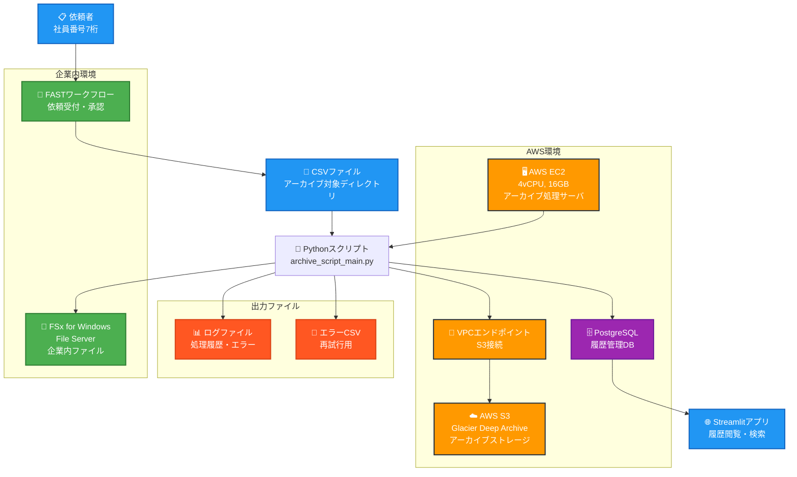
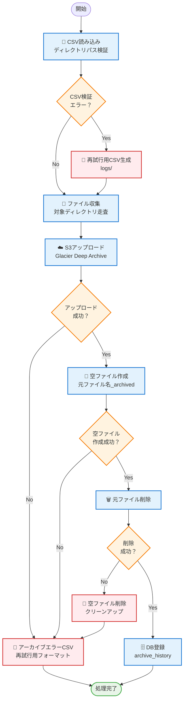

# アーカイブシステム詳細設計書

## 1. システム概要

### 1.1 システム目的

企業内ファイルサーバ（FSx for Windows File Server）上のファイルを、ユーザー依頼に基づいて AWS S3（Glacier Deep Archive）にアーカイブし、履歴管理・復元機能を提供する。

### 1.2 システム構成図



### 1.3 処理フロー図



### 1.3 技術スタック

- **処理サーバ**: AWS EC2（4vCPU、16GB メモリ）
- **言語**: Python 3.x
- **データベース**: PostgreSQL
- **Web アプリ**: Streamlit
- **AWS 連携**: boto3、AWS CLI
- **ファイルサーバ**: FSx for Windows File Server

## 2. データベース設計

### 2.1 テーブル設計

#### 2.1.1 archive_history テーブル

| カラム名           | データ型    | 制約                                | 説明                     |
| ------------------ | ----------- | ----------------------------------- | ------------------------ |
| id                 | BIGSERIAL   | PRIMARY KEY                         | 主キー（自動採番）       |
| request_id         | VARCHAR(50) | NOT NULL                            | 依頼 ID                  |
| requester          | VARCHAR(7)  | NOT NULL, CHECK                     | 依頼者（社員番号 7 桁）  |
| request_date       | TIMESTAMP   | NOT NULL, DEFAULT CURRENT_TIMESTAMP | 依頼日時                 |
| approval_date      | TIMESTAMP   |                                     | 承認日時                 |
| original_file_path | TEXT        | NOT NULL                            | 元ファイルパス           |
| s3_path            | TEXT        | NOT NULL                            | S3 パス                  |
| archive_date       | TIMESTAMP   | NOT NULL                            | アーカイブ日時           |
| file_size          | BIGINT      | CHECK >= 0                          | ファイルサイズ（バイト） |
| created_at         | TIMESTAMP   | NOT NULL, DEFAULT CURRENT_TIMESTAMP | 作成日時                 |
| updated_at         | TIMESTAMP   | NOT NULL, DEFAULT CURRENT_TIMESTAMP | 更新日時                 |

**注意**: S3 アップロード成功時のみ記録するため、process_status、process_result カラムは削除

### 2.2 インデックス設計

```sql
-- 検索用インデックス
CREATE INDEX idx_archive_history_requester ON archive_history(requester);
CREATE INDEX idx_archive_history_request_date ON archive_history(request_date);
CREATE INDEX idx_archive_history_request_id ON archive_history(request_id);

-- ファイルパス検索用（部分一致）
CREATE INDEX idx_archive_history_original_file_path ON archive_history USING gin(original_file_path gin_trgm_ops);

-- 複合インデックス
CREATE INDEX idx_archive_history_requester_date ON archive_history(requester, request_date);
```

## 3. アーカイブスクリプト設計

### 3.1 クラス設計

#### 3.1.1 ArchiveProcessor クラス

**責務**: アーカイブ処理の全体制御

**主要メソッド**:

```python
class ArchiveProcessor:
    def __init__(config_path: str)
    def load_config(config_path: str) -> Dict
    def setup_logger() -> logging.Logger
    def validate_csv_input(csv_path: str) -> Tuple[List[str], List[Dict]]
    def _validate_directory_path_with_details(path: str) -> Dict
    def collect_files(directories: List[str]) -> List[Dict]
    def archive_to_s3(files: List[Dict]) -> List[Dict]
    def _initialize_s3_client() -> boto3.client
    def _validate_storage_class(storage_class: str) -> str
    def _generate_s3_key(file_path: str) -> str
    def _upload_file_with_retry(...) -> Dict
    def create_archived_files(results: List[Dict]) -> List[Dict]
    def save_to_database(results: List[Dict]) -> None
    def generate_csv_error_file(csv_path: str) -> Optional[str]
    def generate_error_csv(failed_items: List[Dict], csv_path: str) -> Optional[str]
    def run(csv_path: str, request_id: str) -> int
```

**インスタンス変数**:

- `self.config`: 設定情報
- `self.logger`: ログ出力
- `self.csv_errors`: CSV 検証エラー項目のリスト
- `self.stats`: 処理統計情報

### 3.2 処理フロー詳細

#### 3.2.1 CSV 読み込み・検証処理

```
1. CSVファイル読み込み（UTF-8-SIG対応）
2. 行単位での処理
   - 空行スキップ
   - ヘッダー行検出・スキップ
   - パス正規化
3. ディレクトリ検証（詳細エラー理由付き）
   - 存在チェック
   - アクセス権限チェック
   - パス長制限チェック（260文字）
   - 不正文字チェック（<>:"|?*）
4. エラー項目記録（処理継続）
   - self.csv_errorsにエラー詳細を保存
   - 有効なディレクトリとエラー項目をタプルで返却
5. エラーCSV生成（必要時）
   - logsディレクトリに再試行用フォーマットで出力
```

**戻り値**: `Tuple[List[str], List[Dict]]`

- List[str]: 有効なディレクトリパス
- List[Dict]: エラー項目（line_number, path, error_reason, original_line）

#### 3.2.2 ファイル収集処理

```
1. 各ディレクトリをos.walkで走査
2. ファイルごとの処理
   - 除外拡張子チェック
   - ファイルサイズ制限チェック
   - ファイル情報取得（サイズ、更新日時）
3. ファイル情報リスト生成
```

#### 3.2.3 S3 アップロード処理

```
1. boto3 S3クライアント初期化
   - VPCエンドポイント対応
   - 接続テスト実行
   - ストレージクラス自動変換（GLACIER_DEEP_ARCHIVE → DEEP_ARCHIVE）
2. S3キー生成（サーバ名ベース）
   - UNCパス: \\server\share\path → server/share/path
   - ローカルパス: C:\path → local_c/path
   - フォールバック: fallback/timestamp/filename
3. ファイル単位でのアップロード
   - Deep Archive直接指定
   - 指数バックオフリトライ（最大3回）
   - 権限エラー・ファイル不存在はリトライしない
4. 進捗ログ出力
   - [n/total] 形式の進捗表示
   - 成功/失敗の詳細ログ
5. アップロード結果記録
   - success, error, s3_key, file_size等の情報を保持
```

**エラーハンドリング**:

- FileNotFoundError: リトライなし
- PermissionError: リトライなし
- その他のエラー: 指数バックオフでリトライ

#### 3.2.4 アーカイブ後処理

```
1. S3アップロード成功ファイルのみ処理
2. 空ファイル作成
   - ファイル名: {元ファイル名}{archived_suffix}
   - 内容: 完全に空（0バイト）
   - 拡張子: 元ファイルの拡張子は保持しない
3. 空ファイル作成成功後に元ファイル削除
4. 失敗時のクリーンアップ
   - 作成済み空ファイルの削除
   - 元ファイルの保護
5. 処理結果記録
   - archive_completed フラグの設定
   - archived_file_path の記録
```

**処理順序の安全性**:

- 空ファイル作成 → 元ファイル削除の順序で実行
- 途中で失敗した場合、元ファイルは保護される
- 作成済み空ファイルは自動的にクリーンアップ

**空ファイル命名例**:

```
元ファイル: document.pdf → 空ファイル: document.pdf_archived
元ファイル: data.xlsx → 空ファイル: data.xlsx_archived
元ファイル: image.jpg → 空ファイル: image.jpg_archived
```

#### 3.2.5 データベース登録処理

```
1. PostgreSQL接続
2. トランザクション開始
3. archive_historyテーブル挿入
4. コミット・ロールバック処理
```

### 3.3 エラーハンドリング設計

#### 3.3.1 エラーレベル分類

- **CRITICAL**: システム停止が必要なエラー
- **ERROR**: 個別ファイル処理失敗
- **WARNING**: 警告（処理継続可能）
- **INFO**: 一般的な処理情報

#### 3.3.2 エラー CSV 出力仕様

**CSV 検証エラー用**: `logs/{元ファイル名}_csv_retry_{YYYYMMDD_HHMMSS}.csv`

- 元 CSV と同じフォーマット（再実行可能）
- エラーが発生したパスのみを記録
- 詳細なエラー理由はログファイルに出力

```csv
Directory Path
\\invalid\path
\\another\invalid\path
```

**アーカイブエラー用**: `logs/{元ファイル名}_archive_retry_{YYYYMMDD_HHMMSS}.csv`

- 元 CSV と同じフォーマット（再実行可能）
- 失敗したファイルを含むディレクトリを重複除去して記録
- エラー統計をログに出力

```csv
Directory Path
\\server\share\failed_directory1
\\server\share\failed_directory2
```

**出力先**: 全て logs ディレクトリに統一

**エラー理由のログ出力例**:

```
CSV検証エラー:
行 2: ディレクトリが存在しません ✗
行 3: 不正な文字が含まれています: | ✗

アーカイブエラー統計:
エラー理由の内訳:
  - AccessDenied: 5件
  - NoSuchBucket: 3件
  - ファイルアクセス権限がありません: 2件
```

### 3.4 設定ファイル設計

#### 3.4.1 設定項目

```json
{
  "aws": {
    "region": "ap-northeast-1",
    "s3_bucket": "your-archive-bucket",
    "storage_class": "DEEP_ARCHIVE",
    "vpc_endpoint_url": "https://bucket.vpce-xxx.s3.ap-northeast-1.vpce.amazonaws.com"
  },
  "database": {
    "host": "localhost",
    "port": 5432,
    "database": "archive_system",
    "user": "postgres",
    "password": "password"
  },
  "file_server": {
    "base_path": "\\\\server\\share\\",
    "archived_suffix": "_archived",
    "exclude_extensions": [".tmp", ".lock", ".bak"]
  },
  "processing": {
    "max_file_size": 10737418240,
    "chunk_size": 8388608,
    "retry_count": 3
  },
  "logging": {
    "log_directory": "logs",
    "log_level": "INFO"
  }
}
```

#### 3.4.2 設定値の自動調整

- **ストレージクラス**: `GLACIER_DEEP_ARCHIVE` → `DEEP_ARCHIVE` 自動変換
- **バケット名**: 前後スペースの自動除去
- **デフォルト値**: 設定が不足している場合の自動補完
- **設定読み込み失敗**: デフォルト設定で継続実行

## 4. Streamlit アプリケーション設計

### 4.1 画面構成

#### 4.1.1 メイン画面

- **ヘッダー**: アプリケーション名、現在日時
- **検索フィルター**: 日付範囲、依頼者、処理状況
- **履歴一覧**: ページネーション対応テーブル
- **集計情報**: ファイル数、総サイズ等の統計
- **エクスポート**: Excel/CSV ダウンロードボタン

#### 4.1.2 検索・フィルタリング機能

```python
# フィルター項目
- 依頼日範囲（from_date, to_date）
- 依頼者（社員番号）
- 処理状況（複数選択可能）
- ファイルパス（部分一致検索）
```

#### 4.1.3 データ表示項目

- 依頼 ID
- 依頼者
- 依頼日時
- 処理状況
- 元ファイルパス（省略表示）
- ファイルサイズ
- アーカイブ日時
- 処理結果

### 4.2 機能詳細

#### 4.2.1 履歴検索機能

```sql
-- 基本検索クエリ
SELECT id, request_id, requester, request_date,
       process_status, original_file_path, file_size, archive_date
FROM archive_history
WHERE request_date BETWEEN %s AND %s
  AND requester LIKE %s
  AND process_status IN %s
ORDER BY request_date DESC
LIMIT %s OFFSET %s;
```

#### 4.2.2 集計機能

```sql
-- 集計クエリ例
SELECT
    COUNT(*) as total_files,
    SUM(file_size) as total_size,
    COUNT(CASE WHEN process_status = 'completed' THEN 1 END) as completed_files,
    COUNT(CASE WHEN process_status = 'error' THEN 1 END) as error_files
FROM archive_history
WHERE request_date BETWEEN %s AND %s;
```

#### 4.2.3 エクスポート機能

- **Excel 形式**: `pandas.to_excel()`使用
- **CSV 形式**: `pandas.to_csv()`使用
- **ファイル名**: `archive_history_{YYYYMMDD_HHMMSS}.{xlsx|csv}`

## 5. 復元スクリプト設計

### 5.1 復元処理フロー

```
1. 復元依頼CSV読み込み
2. S3復元リクエスト送信
3. 復元完了待機
4. ファイルダウンロード
5. 指定ディレクトリに配置
6. 処理結果ログ出力
```

### 5.2 復元 CSV 仕様

```csv
復元対象パス,復元先ディレクトリ
archive/path/to/file.txt,C:\restored\files\
archive/path/to/file2.txt,C:\restored\files\
```

### 5.3 復元処理詳細設計

**TODO**: 復元スクリプトの詳細設計（後続で実装）

## 6. 運用・監視設計

### 6.1 ログ設計

#### 6.1.1 ログレベル

- **DEBUG**: デバッグ情報（ファイルのみ）
- **INFO**: 処理進捗情報
- **WARNING**: 警告（処理継続可能）
- **ERROR**: エラー（個別処理失敗）
- **CRITICAL**: 重大エラー（システム停止）

#### 6.1.2 ログ出力先

- **コンソール**: INFO レベル以上
- **ログファイル**: DEBUG レベル以上
- **ファイル名**: `logs/archive_{YYYYMMDD_HHMMSS}.log`

#### 6.1.3 ログローテーション

- **保持期間**: 30 日
- **ファイルサイズ制限**: 100MB
- **圧縮**: gzip 圧縮

### 6.2 パフォーマンス考慮事項

#### 6.2.1 想定処理規模

- **月間依頼件数**: 100-200 件
- **月間処理ファイル数**: 10,000-20,000 ファイル
- **並行処理**: 現時点では実装しない（2 人 1 組運用）

#### 6.2.2 最適化ポイント

- データベースのコミット方式（ディレクトリ単位 vs 一括）
- S3 アップロードのチャンクサイズ
- ファイル収集時のメモリ使用量

## 7. セキュリティ設計

### 7.1 認証・認可

- **アクセス権限**: 運用管理者のみ
- **依頼者権限**: 企業社員番号 7 桁による識別
- **ファイルアクセス**: 部署ごとに独立したファイルサーバ構成

### 7.2 データ保護

- **通信暗号化**: VPC エンドポイント経由の HTTPS 通信
- **データベース接続**: SSL 接続（設定による）
- **ログ保護**: 機密情報のマスキング

## 8. 今後の拡張計画

### 8.1 短期拡張（3 ヶ月以内）

- [x] CSV 検証エラー処理の改善（処理継続・エラー CSV 生成）
- [x] S3 アップロード機能の実装（boto3、VPC エンドポイント対応）
- [x] エラーハンドリングの強化（再試行可能 CSV フォーマット）
- [x] S3 パス構造の改善（サーバ名ベース）
- [x] アーカイブ後処理の実装（空ファイル作成 → 元ファイル削除）
- [ ] データベース登録処理の実装
- [ ] 復元スクリプトの実装
- [ ] 進捗確認機能の実装

### 8.2 中期拡張（6 ヶ月以内）

- [ ] 並行処理対応
- [ ] パフォーマンス最適化
- [ ] 監視・アラート機能

### 8.3 長期拡張（1 年以内）

- [ ] Web UI での依頼受付機能
- [ ] 自動スケジューリング機能
- [ ] レポート機能の拡充

## 9. 運用手順書

### 9.1 アーカイブ処理手順

```bash
# 1. 設定ファイル確認
python -m json.tool config/archive_config.json

# 2. CSVファイル準備確認
head -5 /path/to/archive_request.csv

# 3. アーカイブ処理実行
python archive_script_main.py /path/to/archive_request.csv REQ-YYYY-XXX

# 4. 処理結果確認
ls -la logs/
tail -f logs/archive_YYYYMMDD_HHMMSS.log

# 5. エラー発生時の再実行
python archive_script_main.py logs/archive_request_archive_retry_YYYYMMDD_HHMMSS.csv REQ-YYYY-XXX-RETRY
```

### 9.2 エラー対応フロー

```
1. ログファイルでエラー詳細を確認
2. エラー種別に応じた対応
   - CSV検証エラー: パス修正後、再試行用CSVで再実行
   - アーカイブエラー: 権限・接続確認後、再試行用CSVで再実行
3. 再実行用CSVは logs/ ディレクトリに自動生成される
4. エラー統計でエラー理由の分布を確認
```

### 9.3 S3 パス構造の確認

```bash
# アップロード結果の確認
aws s3 ls s3://bucket-name/server-name/ --recursive

# 期待されるパス構造
s3://bucket/amznfsxbeak7dyp/share/project1/file.txt
s3://bucket/local_c/temp/file.txt
```

### 9.4 トラブルシューティング

#### 9.4.1 よくあるエラーと対処法

- **CSV 読み込みエラー**: 文字エンコーディング確認（UTF-8-SIG 推奨）
- **ストレージクラスエラー**: `GLACIER_DEEP_ARCHIVE` → `DEEP_ARCHIVE` に自動変換されるか確認
- **S3 接続エラー**: VPC エンドポイント・認証情報確認
- **権限エラー**: IAM ロールに`s3:PutObject`権限があるか確認
- **データベース接続エラー**: 接続設定・ネットワーク確認
- **ファイルアクセスエラー**: 権限・パス存在確認

#### 9.4.2 ログの確認ポイント

```
# 成功パターン
✓ アップロード成功: server/share/project1/file.txt

# 失敗パターン
✗ アップロード失敗: \\server\share\file.txt - AccessDenied
エラー理由の内訳:
  - AccessDenied: 5件
  - NoSuchBucket: 3件
```

#### 9.4.3 再試行用 CSV 確認

```bash
# 生成された再試行用CSVの確認
cat logs/test_directories_archive_retry_20250715_152204.csv

# 元CSVと同じフォーマットか確認
Directory Path
\\server\share\failed_directory
```

## 10. 更新履歴

| 日付       | バージョン | 更新内容                                      | 更新者             |
| ---------- | ---------- | --------------------------------------------- | ------------------ |
| 2025-07-14 | 1.0        | 初版作成                                      | システム開発チーム |
| 2025-07-15 | 1.1        | CSV 検証エラー処理改善、S3 アップロード実装   | システム開発チーム |
| 2025-07-15 | 1.2        | エラー CSV 出力先変更、再試行フォーマット実装 | システム開発チーム |
| 2025-07-15 | 1.3        | アーカイブ後処理実装完了                      | システム開発チーム |

### 主要な変更内容（v1.3）

- アーカイブ後処理の実装完了
  - 安全な処理順序：空ファイル作成 → 元ファイル削除
  - 完全な空ファイル（0 バイト、拡張子なしサフィックス）
  - 失敗時の自動クリーンアップ機能
- 設定ファイルの archived_suffix から.txt 拡張子削除
- エラーハンドリングの強化

---

**注意**: この設計書は実装の進捗に応じて随時更新されます。
