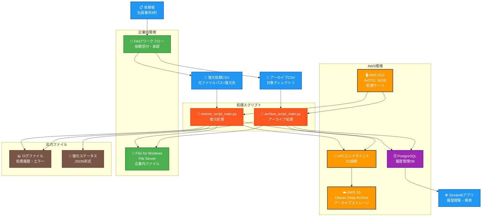
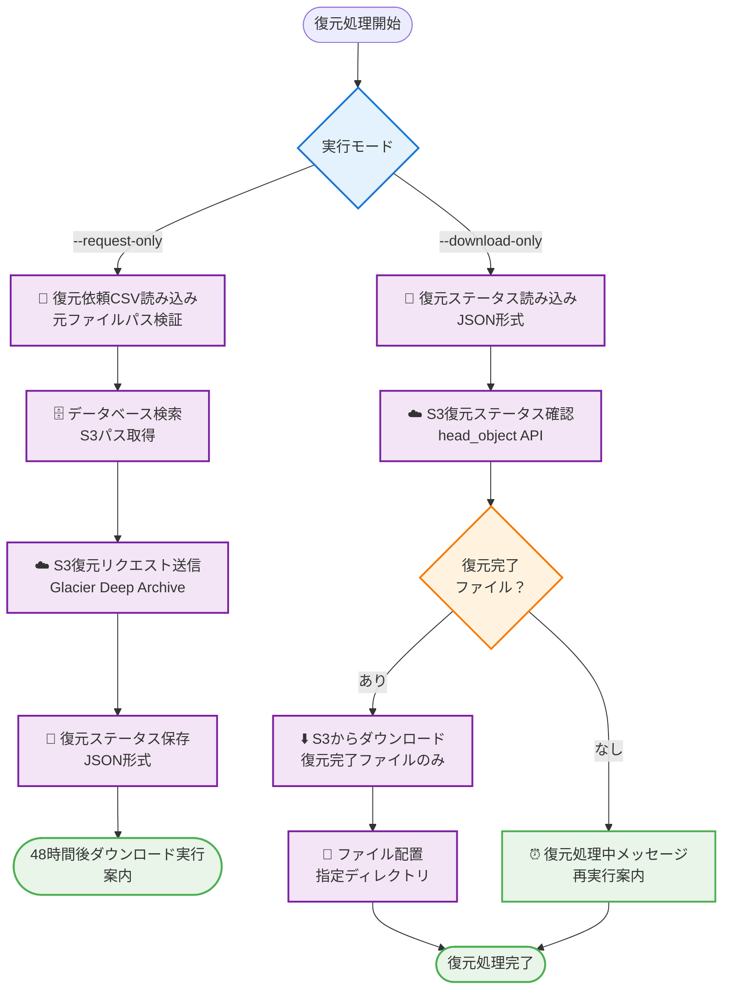

# アーカイブシステム詳細設計書

## 1. システム概要

### 1.1 システム目的

企業内ファイルサーバ（FSx for Windows File Server）上のファイルを、ユーザー依頼に基づいて AWS S3（Glacier Deep Archive）にアーカイブし、履歴管理・復元機能を提供する。

### 1.2 システム構成図



### 1.3 技術スタック

- **処理サーバ**: AWS EC2（4vCPU、16GB メモリ）
- **言語**: Python 3.8 以上
- **データベース**: PostgreSQL
- **Web アプリ**: Streamlit
- **AWS 連携**: boto3、AWS CLI
- **ファイルサーバ**: FSx for Windows File Server
- **テストフレームワーク**: pytest、pytest-cov

## 2. データベース設計

### 2.1 テーブル設計

#### 2.1.1 archive_history テーブル

| カラム名           | データ型    | 制約                                | 説明                     |
| ------------------ | ----------- | ----------------------------------- | ------------------------ |
| id                 | BIGSERIAL   | PRIMARY KEY                         | 主キー（自動採番）       |
| request_id         | VARCHAR(50) | NOT NULL                            | 依頼 ID                  |
| requester          | VARCHAR(8)  | NOT NULL, CHECK                     | 依頼者（社員番号 8 桁）  |
| request_date       | TIMESTAMP   | NOT NULL, DEFAULT CURRENT_TIMESTAMP | 依頼日時                 |
| approval_date      | TIMESTAMP   |                                     | 承認日時                 |
| original_file_path | TEXT        | NOT NULL                            | 元ファイルパス           |
| s3_path            | TEXT        | NOT NULL                            | S3 パス                  |
| archive_date       | TIMESTAMP   | NOT NULL                            | アーカイブ日時           |
| file_size          | BIGINT      | CHECK >= 0                          | ファイルサイズ（バイト） |
| created_at         | TIMESTAMP   | NOT NULL, DEFAULT CURRENT_TIMESTAMP | 作成日時                 |
| updated_at         | TIMESTAMP   | NOT NULL, DEFAULT CURRENT_TIMESTAMP | 更新日時                 |

**注意**: S3 アップロード成功時のみ記録

### 2.2 インデックス設計

```sql
-- 検索用インデックス
CREATE INDEX idx_archive_history_requester ON archive_history(requester);
CREATE INDEX idx_archive_history_request_date ON archive_history(request_date);
CREATE INDEX idx_archive_history_request_id ON archive_history(request_id);

-- ファイルパス検索用（復元処理で使用）
CREATE INDEX idx_archive_history_original_file_path ON archive_history USING gin(original_file_path gin_trgm_ops);

-- 複合インデックス
CREATE INDEX idx_archive_history_requester_date ON archive_history(requester, request_date);
```

## 3. アーカイブスクリプト設計

### 3.1 アーカイブ処理フロー


### 3.2 ArchiveProcessor クラス設計

**責務**: アーカイブ処理の全体制御

**主要メソッド**:

```python
class ArchiveProcessor:
    def __init__(config_path: str)
    def load_config(config_path: str) -> Dict
    def setup_logger() -> logging.Logger
    def validate_csv_input(csv_path: str) -> Tuple[List[str], List[Dict]]
    def _validate_directory_path_with_details(path: str) -> Dict
    def collect_files(directories: List[str]) -> List[Dict]
    def archive_to_s3(files: List[Dict]) -> List[Dict]
    def _initialize_s3_client() -> boto3.client
    def _validate_storage_class(storage_class: str) -> str
    def _generate_s3_key(file_path: str) -> str
    def _upload_file_with_retry(...) -> Dict
    def create_archived_files(results: List[Dict]) -> List[Dict]
    def save_to_database(results: List[Dict]) -> None
    def generate_csv_error_file(csv_path: str) -> Optional[str]
    def generate_error_csv(failed_items: List[Dict], csv_path: str) -> Optional[str]
    def run(csv_path: str, request_id: str) -> int
```

### 3.3 アーカイブ処理詳細

#### 3.3.1 CSV 読み込み・検証処理

- UTF-8-SIG 対応
- ヘッダー行自動検出・スキップ
- ディレクトリ検証（存在・権限・パス長・不正文字）
- エラー項目記録（処理継続）

#### 3.3.2 S3 アップロード処理

- VPC エンドポイント対応
- ストレージクラス自動変換（GLACIER_DEEP_ARCHIVE → DEEP_ARCHIVE）
- サーバ名ベース S3 キー生成
- 指数バックオフリトライ（最大 3 回）

#### 3.3.3 アーカイブ後処理

- 空ファイル作成（{元ファイル名}\_archived）
- 元ファイル削除
- 失敗時の自動クリーンアップ

## 4. 復元スクリプト設計

### 4.1 復元処理フロー



### 4.2 RestoreProcessor クラス設計

**責務**: 復元処理の全体制御

**主要メソッド**:

```python
class RestoreProcessor:
    def __init__(config_path: str)
    def load_config(config_path: str) -> Dict
    def setup_logger() -> logging.Logger
    def validate_csv_input(csv_path: str) -> Tuple[List[Dict], List[Dict]]
    def _validate_restore_request(original_file_path: str, restore_dir: str) -> Dict
    def lookup_s3_paths_from_database(restore_requests: List[Dict]) -> List[Dict]
    def request_restore(restore_requests: List[Dict]) -> List[Dict]
    def check_restore_completion(restore_requests: List[Dict]) -> List[Dict]
    def download_and_place_files(restore_requests: List[Dict]) -> List[Dict]
    def _download_file_with_retry(...) -> Dict
    def _place_file_to_destination(temp_path: str, destination_path: str) -> Dict
    def _save_restore_status(restore_requests: List[Dict]) -> None
    def _load_restore_status() -> List[Dict]
    def run(csv_path: str, request_id: str, mode: str) -> int
```

### 4.3 復元処理詳細

#### 4.3.1 復元依頼 CSV 検証

- 元ファイルパス+復元先ディレクトリの検証
- 復元先の存在・書き込み権限確認
- パス長制限・形式チェック

#### 4.3.2 S3 復元リクエスト送信

- restore_object API 実行
- 復元ティア指定（Standard/Expedited/Bulk）
- 復元保持日数設定（デフォルト 7 日）

#### 4.3.3 復元ステータス確認

- head_object API で Restore ヘッダー確認
- ステータス判定（pending/in_progress/completed/failed）
- 復元有効期限抽出

#### 4.3.4 ダウンロード・配置処理

- 一時ディレクトリでの安全なダウンロード
- 0 バイトファイル対応
- 同名ファイルスキップ機能
- 自動クリーンアップ

### 4.4 復元ステータス管理

**ステータスファイル**: `logs/restore_status_{request_id}.json`

```json
{
  "request_id": "REQ-2025-001",
  "request_date": "2025-07-16T10:30:00",
  "total_requests": 10,
  "restore_requests": [
    {
      "line_number": 2,
      "original_file_path": "\\\\server\\share\\file.txt",
      "restore_directory": "C:\\restored\\",
      "s3_path": "s3://bucket/server/share/file.txt",
      "bucket": "bucket",
      "key": "server/share/file.txt",
      "restore_status": "completed",
      "restore_request_time": "2025-07-16T10:30:15",
      "restore_completed_time": "2025-07-18T14:20:00",
      "restore_expiry": "Fri, 25 Jul 2025 14:20:00 GMT",
      "download_status": "completed",
      "destination_path": "C:\\restored\\file.txt",
      "downloaded_size": 1024
    }
  ]
}
```

## 5. Streamlit アプリケーション設計

### 5.1 画面構成

#### 5.1.1 メイン画面

- **ヘッダー**: アプリケーション名、現在日時
- **検索フィルター**: 日付範囲、依頼者、処理状況
- **履歴一覧**: ページネーション対応テーブル
- **集計情報**: ファイル数、総サイズ等の統計
- **エクスポート**: Excel/CSV ダウンロードボタン

#### 5.1.2 検索・フィルタリング機能

```python
# フィルター項目
- 依頼日範囲（from_date, to_date）
- 依頼者（社員番号）
- ファイルパス（部分一致検索）
```

#### 5.1.3 データ表示項目

- 依頼 ID
- 依頼者
- 依頼日時
- 元ファイルパス（省略表示）
- ファイルサイズ
- アーカイブ日時

### 5.2 機能詳細

#### 5.2.1 履歴検索機能

```sql
-- 基本検索クエリ
SELECT id, request_id, requester, request_date,
       original_file_path, file_size, archive_date
FROM archive_history
WHERE request_date BETWEEN %s AND %s
  AND requester LIKE %s
ORDER BY request_date DESC
LIMIT %s OFFSET %s;
```

#### 5.2.2 集計機能

```sql
-- 集計クエリ例
SELECT
    COUNT(*) as total_files,
    SUM(file_size) as total_size,
    COUNT(DISTINCT request_id) as total_requests
FROM archive_history
WHERE request_date BETWEEN %s AND %s;
```

#### 5.2.3 エクスポート機能

- **Excel 形式**: `pandas.to_excel()`使用
- **CSV 形式**: `pandas.to_csv()`使用
- **ファイル名**: `archive_history_{YYYYMMDD_HHMMSS}.{xlsx|csv}`

## 6. 設定管理

### 6.1 共通設定ファイル

```json
{
  "aws": {
    "region": "ap-northeast-1",
    "s3_bucket": "your-archive-bucket",
    "storage_class": "DEEP_ARCHIVE",
    "vpc_endpoint_url": "https://bucket.vpce-xxx.s3.region.vpce.amazonaws.com"
  },
  "database": {
    "host": "localhost",
    "port": 5432,
    "database": "archive_system",
    "user": "postgres",
    "password": "password",
    "timeout": 30
  },
  "request": {
    "requester": "12345678"
  },
  "file_server": {
    "archived_suffix": "_archived",
    "exclude_extensions": [".tmp", ".lock", ".bak"]
  },
  "processing": {
    "max_file_size": 10737418240,
    "chunk_size": 8388608,
    "retry_count": 3
  },
  "restore": {
    "restore_tier": "Standard",
    "restore_days": 7,
    "download_retry_count": 3,
    "skip_existing_files": true,
    "temp_download_directory": "temp_downloads"
  },
  "logging": {
    "log_directory": "logs",
    "log_level": "INFO"
  }
}
```

### 6.2 主要設定項目

#### 6.2.1 アーカイブ設定

- **storage_class**: 自動変換対応（GLACIER_DEEP_ARCHIVE → DEEP_ARCHIVE）
- **archived_suffix**: 空ファイルサフィックス
- **exclude_extensions**: 除外拡張子リスト

#### 6.2.2 復元設定

- **restore_tier**: 復元速度ティア（Standard/Expedited/Bulk）
- **restore_days**: 復元後保持日数（1-30 日）
- **skip_existing_files**: 同名ファイルスキップ

## 7. エラーハンドリング・ログ

### 7.1 エラー分類

| エラー種別             | アーカイブ | 復元 | 処理継続 | リトライ |
| ---------------------- | ---------- | ---- | -------- | -------- |
| CSV 読み込みエラー     | ✓          | ✓    | ×        | -        |
| CSV 検証エラー         | ✓          | ✓    | ✓        | -        |
| S3 接続エラー          | ✓          | ✓    | ×        | -        |
| S3 操作エラー          | ✓          | ✓    | ✓        | ✓        |
| ファイルアクセスエラー | ✓          | ✓    | ✓        | ×        |
| データベース接続エラー | ✓          | ✓    | ✓        | ×        |

### 7.2 ログレベル

| レベル  | 用途         | 例                                                   |
| ------- | ------------ | ---------------------------------------------------- |
| DEBUG   | デバッグ情報 | S3 キー生成詳細、一時ファイル削除                    |
| INFO    | 処理進捗     | ファイル収集完了、復元完了                           |
| WARNING | 警告         | アップロード失敗（リトライ中）、同名ファイルスキップ |
| ERROR   | エラー       | ディレクトリが存在しません、復元失敗                 |

### 7.3 エラー CSV 出力

#### 7.3.1 アーカイブエラー CSV

- **CSV 検証エラー**: `logs/{元ファイル名}_csv_retry_{timestamp}.csv`
- **アーカイブエラー**: `logs/{元ファイル名}_archive_retry_{timestamp}.csv`

#### 7.3.2 復元エラー CSV

- **復元依頼エラー**: `logs/{元ファイル名}_restore_errors_{timestamp}.csv`

## 8. 運用・監視設計

### 8.1 運用フロー

#### 8.1.1 アーカイブ運用フロー

```bash
# 1. アーカイブ処理実行
python archive_script_main.py archive_request.csv REQ-2025-001

# 2. エラー発生時の再実行
python archive_script_main.py logs/archive_request_retry_*.csv REQ-2025-001-RETRY
```

#### 8.1.2 復元運用フロー

```bash
# 1. 復元リクエスト送信
python restore_script_main.py restore_request.csv REQ-RESTORE-001 --request-only

# 2. 48時間後、ダウンロード実行
python restore_script_main.py restore_request.csv REQ-RESTORE-001 --download-only
```

### 8.2 監視項目

#### 8.2.1 処理監視

- **処理時間**: 想定処理時間との比較
- **成功率**: ファイル単位・依頼単位の成功率
- **エラー傾向**: エラー種別・頻度の分析

#### 8.2.2 リソース監視

- **ディスク使用量**: ログファイル・一時ファイル
- **メモリ使用量**: 大量ファイル処理時
- **ネットワーク**: S3 転送速度

### 8.3 ログローテーション

```bash
# ログ保持期間: 30日
find logs/ -name "*.log" -mtime +30 -delete

# ログ圧縮: 7日経過
find logs/ -name "*.log" -mtime +7 -exec gzip {} \;
```

## 9. セキュリティ設計

### 9.1 認証・認可

- **アクセス権限**: 運用管理者のみ
- **依頼者権限**: 企業社員番号 8 桁による識別
- **ファイルアクセス**: 部署ごとに独立したファイルサーバ構成

### 9.2 データ保護

- **通信暗号化**: VPC エンドポイント経由の HTTPS 通信
- **データベース接続**: SSL 接続（設定による）
- **ログ保護**: 機密情報のマスキング

## 10. パフォーマンス設計

### 10.1 処理能力

- **想定ファイル数**: 10,000-20,000 ファイル/月
- **最大ファイルサイズ**: 10GB（設定可能）
- **並行処理**: なし（シーケンシャル処理）

### 10.2 最適化ポイント

- **S3 転送**: チャンクサイズ最適化
- **データベース**: バッチ挿入・インデックス活用
- **メモリ効率**: ファイル単位処理

## 11. 今後の拡張計画

### 11.1 短期拡張（3 ヶ月以内）

- [x] CSV 検証エラー処理の改善（処理継続・エラー CSV 生成）
- [x] S3 アップロード機能の実装（boto3、VPC エンドポイント対応）
- [x] エラーハンドリングの強化（再試行可能 CSV フォーマット）
- [x] S3 パス構造の改善（サーバ名ベース）
- [x] アーカイブ後処理の実装（空ファイル作成 → 元ファイル削除）
- [x] データベース登録処理の実装（PostgreSQL、トランザクション管理）
- [x] 復元スクリプトの基盤実装（CSV 読み込み・検証・DB 検索）
- [x] 復元リクエスト送信機能の実装（S3 restore_object API）
- [x] 復元ステータス確認機能の実装（S3 head_object API）
- [x] 復元ステータス管理機能の実装（JSON 形式でのステータス保存・読み込み）
- [x] 2 段階実行モードの実装（request-only/download-only）
- [x] ダウンロード実行時の自動ステータス確認機能
- [x] ダウンロード・配置機能の実装（同名ファイルスキップ・0 バイトファイル対応）
- [x] 一時ファイル管理機能の実装（安全なダウンロード・クリーンアップ）
- [x] 実機動作検証完了（0 バイトファイル、VPC エンドポイント通信等）
- [ ] Streamlit アプリの実装
- [ ] 単体テストコードの実装

### 11.2 中期拡張（6 ヶ月以内）

- [ ] 並行処理対応
- [ ] パフォーマンス最適化
- [ ] 監視・アラート機能
- [ ] 進捗確認機能の実装

### 11.3 長期拡張（1 年以内）

- [ ] WebUI での依頼受付機能
- [ ] 自動スケジューリング機能
- [ ] レポート機能の拡充

## 12. 運用手順書

### 12.1 アーカイブ処理手順

```bash
# 1. 設定ファイル確認
python -m json.tool config/archive_config.json

# 2. CSVファイル準備確認
head -5
```
