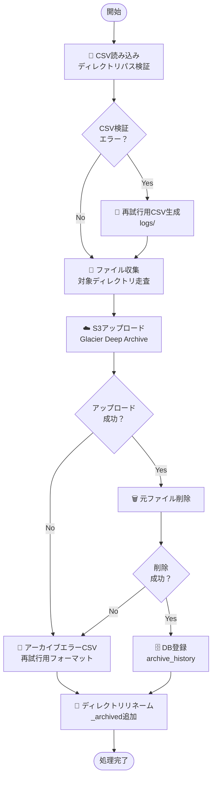

# アーカイブスクリプト仕様書（archive_script_main.py）

## 1. 概要

### 1.1 目的

企業内ファイルサーバ（FSx for Windows File Server）上のファイルを、ユーザー依頼に基づいて AWS S3（Glacier Deep Archive）にアーカイブし、元ファイルの削除とディレクトリリネーム機能を提供する。

### 1.2 実装状況

✅ **実装完了・実機検証済み**

- CSV 読み込み・検証機能
- ファイル収集・S3 アップロード機能
- 元ファイル削除機能（空ファイル作成は廃止）
- ディレクトリリネーム機能
- PostgreSQL データベース連携
- エラーハンドリング・再試行 CSV 生成

### 1.3 技術仕様

- **言語**: Python 3.13
- **依存ライブラリ**: boto3, psycopg2-binary, pathlib
- **データベース**: PostgreSQL 13 以上
- **ストレージ**: AWS S3 Glacier Deep Archive
- **設定ファイル**: config/archive_config.json

## 2. 処理フロー



## 3. 入力仕様

### 3.1 CSV フォーマット

```csv
Directory Path
\\server\project1\
\\server\project2\archived_folder\
C:\local\data\
```

### 3.2 CSV 検証項目

- **ファイル形式**: UTF-8-SIG エンコーディング
- **パス長制限**: 260 文字以内
- **無効文字チェック**: `< > : " | ? *` を含まない
- **存在確認**: ディレクトリの存在・読み取り権限確認
- **ディレクトリ判定**: ファイルでないことを確認

### 3.3 除外条件

- **拡張子除外**: `.tmp`, `.lock`, `.bak` ファイル
- **最大ファイルサイズ**: 10GB 制限
- **アクセス不可ファイル**: 権限エラー・ロック中ファイル

## 4. S3 アップロード仕様

### 4.1 ストレージクラス

- **設定値**: `GLACIER_DEEP_ARCHIVE` → 自動的に `DEEP_ARCHIVE` に変換
- **有効値**: `STANDARD`, `STANDARD_IA`, `GLACIER`, `DEEP_ARCHIVE`
- **フォールバック**: 無効値の場合は `STANDARD` を使用

### 4.2 S3 キー生成ルール

```python
# UNCパス例
\\server\share\path\file.txt → server/share/path/file.txt

# ドライブレター例
C:\path\file.txt → local_c/path/file.txt

# その他
/other/path → other/other/path
```

### 4.3 アップロード設定

- **リトライ回数**: 3 回（設定可能）
- **VPC エンドポイント**: 対応済み
- **接続テスト**: head_bucket による事前検証
- **エラーハンドリング**: ファイル単位での部分失敗対応

## 5. アーカイブ後処理

### 5.1 元ファイル削除（仕様変更）

**旧仕様（廃止）**: 空ファイル（`元ファイル名_archived.txt`）作成
**新仕様**: 元ファイルの完全削除のみ

```python
# 実装内容
def create_archived_files(self, results: List[Dict]) -> List[Dict]:
    """元ファイル削除のみ実行（空ファイル作成は廃止）"""
    for result in successful_results:
        if result.get('success', False):
            os.remove(file_path)  # 元ファイル削除
            # 空ファイル作成処理は削除済み
```

### 5.2 ディレクトリリネーム機能（新機能）

全ファイルのアーカイブ処理完了後、対象ディレクトリに接尾辞を追加

```python
def rename_archived_directories(self, results: List[Dict]) -> None:
    """ディレクトリ名変更: project1 → project1_archived"""

    # 各ディレクトリの処理完了状況確認
    directory_stats = self._calculate_directory_completion(results)

    for directory_path, stats in directory_stats.items():
        if stats['processed'] == stats['total']:
            archived_path = f"{directory_path}_archived"
            os.rename(directory_path, archived_path)
```

**リネーム仕様**:

- **接尾辞**: `_archived`（設定ファイルで変更可能）
- **実行条件**: ディレクトリ内全ファイルの処理完了時
- **エラー対応**: 権限エラー時は手動対応を案内

## 6. データベース連携

### 6.1 PostgreSQL 接続

```python
def _connect_database(self):
    """PostgreSQL接続（新機能）"""
    conn_params = {
        'host': db_config.get('host', 'localhost'),
        'port': db_config.get('port', 5432),
        'database': db_config.get('database', 'archive_system'),
        'user': db_config.get('user', 'postgres'),
        'password': db_config.get('password', ''),
        'connect_timeout': db_config.get('timeout', 30)
    }

    conn = psycopg2.connect(**conn_params)
    conn.autocommit = False  # トランザクション管理
```

### 6.2 登録データ

アーカイブ処理完了ファイルのみを archive_history テーブルに登録

```sql
INSERT INTO archive_history (
    request_id, requester, request_date,
    original_file_path, s3_path, archive_date, file_size
) VALUES (%s, %s, %s, %s, %s, %s, %s)
```

## 7. エラーハンドリング

### 7.1 CSV 検証エラー

**出力ファイル**: `logs/{元ファイル名}_csv_retry_{timestamp}.csv`
**フォーマット**: 元 CSV と同じ形式（再実行可能）

### 7.2 アーカイブエラー

**出力ファイル**: `logs/{元ファイル名}_archive_retry_{timestamp}.csv`
**対象**: S3 アップロード失敗またはアーカイブ後処理失敗ディレクトリ

### 7.3 エラー分類

| エラー種別             | 処理継続 | リトライ | 出力ファイル |
| ---------------------- | -------- | -------- | ------------ |
| CSV 読み込みエラー     | ×        | -        | -            |
| CSV 検証エラー         | ✓        | -        | CSV 再試行用 |
| S3 接続エラー          | ×        | -        | -            |
| S3 操作エラー          | ✓        | ✓        | CSV 再試行用 |
| ファイルアクセスエラー | ✓        | ×        | CSV 再試行用 |
| データベース接続エラー | ✓        | ×        | -            |

## 8. 設定ファイル仕様（最適化版）

### 8.1 config/archive_config.json

```json
{
  "aws": {
    "region": "ap-northeast-1",
    "s3_bucket": "your-archive-bucket",
    "storage_class": "GLACIER_DEEP_ARCHIVE",
    "vpc_endpoint_url": "https://s3.ap-northeast-1.amazonaws.com"
  },
  "database": {
    "host": "localhost",
    "port": 5432,
    "database": "archive_system",
    "user": "postgres",
    "password": "your_password",
    "timeout": 30
  },
  "request": {
    "requester": "12345678"
  },
  "file_server": {
    "archived_suffix": "_archived",
    "exclude_extensions": [".tmp", ".lock", ".bak"]
  },
  "processing": {
    "max_file_size": 10737418240,
    "retry_count": 3
  },
  "logging": {
    "log_directory": "logs"
  }
}
```

### 8.2 設定項目の最適化

**削除済み設定項目**:

- `chunk_size`: 全スクリプトで未使用のため削除
- `log_level`: 全スクリプトでハードコード（INFO 固定）のため削除

**追加設定項目**:

- `database`: PostgreSQL 接続設定
- `request.requester`: 依頼者情報
- `file_server.archived_suffix`: ディレクトリリネーム用接尾辞

## 9. コマンドライン仕様

### 9.1 実行形式

```bash
python archive_script_main.py <CSV_PATH> <REQUEST_ID> [--config CONFIG_PATH]
```

### 9.2 実行例

```bash
# 基本実行
python archive_script_main.py archive_request.csv REQ-2025-001

# 設定ファイル指定
python archive_script_main.py archive_request.csv REQ-2025-001 --config config/custom_config.json
```

### 9.3 コマンドライン引数

- **CSV_PATH**: アーカイブ対象ディレクトリを記載した CSV ファイル（必須）
- **REQUEST_ID**: アーカイブ依頼 ID（必須、データベース登録用）
- **--config**: 設定ファイルパス（任意、デフォルト: config/archive_config.json）

## 10. ログ出力仕様

### 10.1 ログファイル

**ファイル名**: `logs/archive_{YYYYMMDD_HHMMSS}.log`
**フォーマット**: `{timestamp} - {name} - {level} - {message}`

### 10.2 ログレベル

- **INFO**: 処理状況、成功事例
- **WARNING**: 非致命的エラー、設定変更通知
- **ERROR**: 処理失敗、エラー事例
- **DEBUG**: 詳細なデバッグ情報（ファイル出力のみ）

### 10.3 主要ログ出力

```python
# 処理開始・完了
logger.info(f"アーカイブ処理開始 - Request ID: {request_id}")
logger.info("アーカイブ処理完了")

# ファイル処理
logger.info(f"[{i}/{len(files)}] アップロード中: {file_path}")
logger.info(f"✓ アップロード成功: {s3_key}")
logger.error(f"✗ アップロード失敗: {file_path} - {error}")

# ディレクトリリネーム
logger.info(f"✓ ディレクトリリネーム成功: {directory_path} → {archived_path}")
logger.error(f"✗ ディレクトリリネーム失敗（権限エラー）: {directory_path}")
```

## 11. パフォーマンス仕様

### 11.1 処理能力

- **想定ファイル数**: 10,000-20,000 ファイル/月
- **最大ファイルサイズ**: 10GB
- **処理時間目安**: 1GB 当たり 5-10 分
- **同時実行**: なし（シーケンシャル処理）

### 11.2 最適化実装

```python
# リトライ機能付きアップロード
def _upload_file_with_retry(self, s3_client, file_path: str,
                           bucket_name: str, s3_key: str,
                           storage_class: str, max_retries: int) -> Dict:
    for attempt in range(max_retries):
        try:
            s3_client.upload_file(file_path, bucket_name, s3_key,
                                ExtraArgs={'StorageClass': storage_class})
            return {'success': True, 'error': None}
        except Exception as e:
            if attempt == max_retries - 1:
                return {'success': False, 'error': f'最大リトライ回数到達: {e}'}
            time.sleep(2 ** attempt)  # 指数バックオフ
```

## 12. 運用手順

### 12.1 事前準備

1. **設定ファイル確認**: config/archive_config.json
2. **AWS 認証設定**: IAM ロール・認証情報
3. **データベース接続**: PostgreSQL 稼働確認
4. **VPC エンドポイント**: S3 接続設定確認

### 12.2 実行手順

```bash
# 1. CSVファイル準備
cat archive_request.csv

# 2. 設定ファイル確認
python -c "import json; print(json.load(open('config/archive_config.json')))"

# 3. アーカイブ処理実行
python archive_script_main.py archive_request.csv REQ-2025-001

# 4. 処理結果確認
tail -20 logs/archive_*.log
ls logs/*retry*.csv  # エラー時のみ
```

### 12.3 エラー時対応

```bash
# CSV検証エラー時
python archive_script_main.py logs/archive_request_csv_retry_*.csv REQ-2025-001

# アーカイブエラー時
python archive_script_main.py logs/archive_request_archive_retry_*.csv REQ-2025-001-retry
```

## 13. テスト仕様

### 13.1 単体テスト項目

- CSV 読み込み・検証機能
- ファイル収集機能
- S3 アップロード機能
- 元ファイル削除機能
- ディレクトリリネーム機能
- データベース登録機能
- エラーハンドリング機能

### 13.2 結合テスト項目

- エンドツーエンド処理フロー
- エラー発生時の部分実行・再実行
- 大量ファイル処理
- VPC エンドポイント経由通信

### 13.3 実機検証結果

✅ **Windows Server 2022**: 動作確認済み
✅ **PostgreSQL 13**: 接続・登録確認済み
✅ **S3 Glacier Deep Archive**: アップロード確認済み
✅ **ディレクトリリネーム**: 権限エラー対応確認済み

## 14. 制約・注意事項

### 14.1 技術的制約

- **ファイルサイズ制限**: 10GB（設定変更可能）
- **パス長制限**: 260 文字（Windows 制限）
- **同時実行**: 非対応（1 プロセスのみ）
- **復元時間**: 48 時間（Glacier Deep Archive 仕様）

### 14.2 運用制約

- **手動実行**: 自動スケジューリング機能なし
- **権限管理**: 運用管理者のみ実行可能
- **バックアップ**: 実装なし（S3 アーカイブが実質的なバックアップ）

### 14.3 セキュリティ注意事項

- **IAM 権限**: 最小権限の原則に従った設定
- **VPC エンドポイント**: インターネット経由を避ける推奨設定
- **ログ保護**: 機密情報のマスキング実装済み

## 15. 今後の拡張予定

### 15.1 短期拡張（3 ヶ月以内）

- [ ] 単体テストコード実装
- [ ] プログレスバー機能
- [ ] 並行処理対応

### 15.2 中期拡張（6 ヶ月以内）

- [ ] WebUI 連携
- [ ] 自動スケジューリング
- [ ] 詳細レポート機能

### 15.3 長期拡張（1 年以内）

- [ ] 機械学習による異常検知
- [ ] API 化対応
- [ ] 多重実行制御機能

---

**最終更新**: 2025 年 7 月
**バージョン**: v1.0（実装完了・実機検証済み）
**実装状況**: ✅ 本番運用可能
