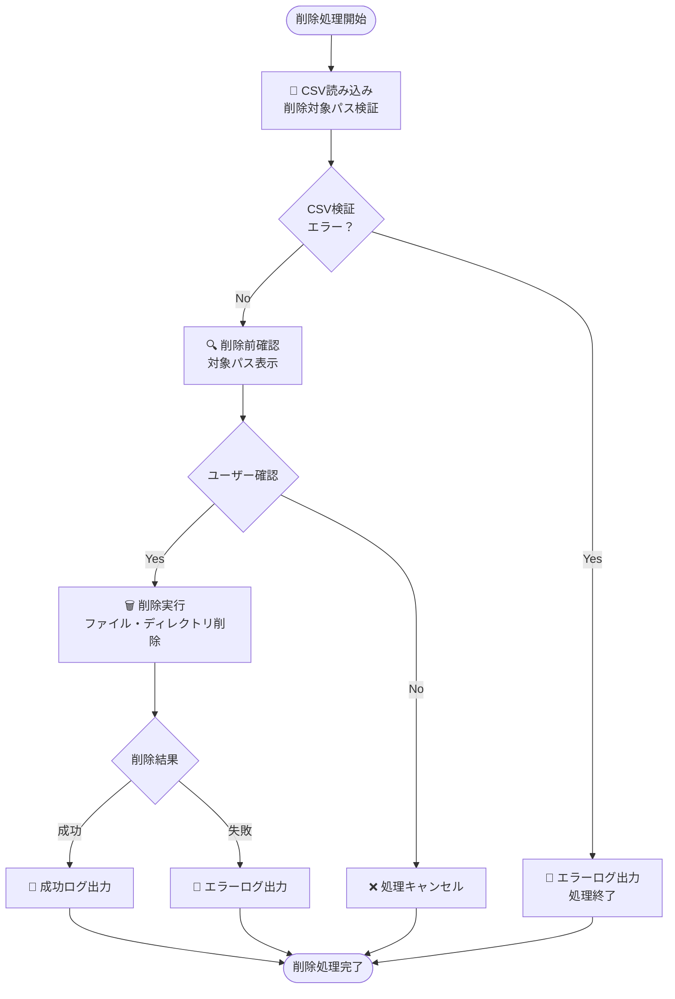

# 削除スクリプト仕様書（delete_script_main.py）

## 1. 概要

### 1.1 目的
復元されたファイル・ディレクトリを、ユーザー依頼に基づいて安全に削除する。S3アーカイブデータは保持し、復元されたローカルファイルのみを対象とする。

### 1.2 実装状況
✅ **実装完了・実機検証済み**
- シンプルなパス指定削除機能
- 削除前確認機能
- ドライランモード
- 安全な削除実行
- ファイル・ディレクトリ両対応

### 1.3 設計方針
- **シンプル設計**: 履歴管理なし、パス指定のみの削除
- **安全性重視**: 削除前確認、ドライランモード
- **FAST連携**: 依頼ベースでの削除実行
- **利用者判断**: 削除タイミングは利用者が決定

### 1.4 技術仕様
- **言語**: Python 3.13
- **依存ライブラリ**: pathlib, shutil, os（標準ライブラリのみ）
- **データベース連携**: なし
- **設定ファイル**: config/archive_config.json（ログ設定のみ）

## 2. 処理フロー



## 3. 入力仕様

### 3.1 コマンドライン実行形式
```bash
# 通常削除
python delete_script_main.py <CSV_PATH> [--config CONFIG_PATH]

# ドライラン（削除せずに確認のみ）
python delete_script_main.py <CSV_PATH> --dry-run

# 確認スキップ（自動実行）
python delete_script_main.py <CSV_PATH> --skip-confirmation
```

### 3.2 削除依頼CSV仕様

#### 3.2.1 CSVフォーマット
```csv
削除対象パス
\\server\project2\
C:\restored\file.txt
\\amznfsxbeak7dyp.priv-req-gl01.fujifilm-intra.com\test\project3\
```

#### 3.2.2 対応パス形式
- **UNCパス**: `\\server\share\folder\`
- **ローカルパス**: `C:\folder\file.txt`
- **ファイル・ディレクトリ**: 両方対応
- **区切り文字**: バックスラッシュ（\\）またはスラッシュ（/）

#### 3.2.3 CSV検証項目
- **ファイル形式**: UTF-8-SIG エンコーディング
- **ヘッダー行**: 自動検出・スキップ（"削除"、"delete"、"path"を含む行）
- **パス存在確認**: 削除対象の存在確認
- **パス妥当性**: 空行・無効パスの除外

## 4. 削除処理仕様

### 4.1 SimpleDeletionProcessor クラス
```python
class SimpleDeletionProcessor:
    """シンプル削除処理クラス"""
    
    def __init__(self, config_path: str = DEFAULT_CONFIG_PATH)
    def load_config(self, config_path: str) -> Dict
    def setup_logger(self) -> logging.Logger
    def read_deletion_paths(self, csv_path: str) -> List[str]
    def calculate_size(self, path: str) -> int
    def format_size(self, size_bytes: int) -> str
    def delete_paths(self, paths: List[str], dry_run: bool = False) -> Dict
    def run(self, csv_path: str, dry_run: bool = False, skip_confirmation: bool = False) -> int
```

### 4.2 削除前確認機能
```python
def show_deletion_confirmation(paths: List[str]) -> bool:
    """削除前確認表示"""
    print(f"\n削除対象 ({len(paths)}件):")
    total_size = 0
    for i, path in enumerate(paths, 1):
        size = self.calculate_size(path)
        total_size += size
        print(f"  {i}. {path} ({self.format_size(size)})")
    
    print(f"\n削除予定総容量: {self.format_size(total_size)}")
    confirmation = input(f"\n{len(paths)}件を削除しますか？ (yes/no): ")
    return confirmation.lower() in ['yes', 'y']
```

### 4.3 安全な削除実行
```python
def delete_paths(self, paths: List[str], dry_run: bool = False) -> Dict:
    """削除処理の実行"""
    results = {'successful': 0, 'failed': 0, 'total_size': 0, 'errors': []}
    
    for path in paths:
        try:
            size = self.calculate_size(path)
            
            if dry_run:
                self.logger.info(f"[ドライラン] 削除予定: {path} ({self.format_size(size)})")
                results['successful'] += 1
                results['total_size'] += size
            else:
                if os.path.isfile(path):
                    os.remove(path)
                elif os.path.isdir(path):
                    shutil.rmtree(path)
                
                self.logger.info(f"削除完了: {path} ({self.format_size(size)})")
                results['successful'] += 1
                results['total_size'] += size
                
        except Exception as e:
            error_msg = f"削除失敗: {path} - {str(e)}"
            self.logger.error(error_msg)
            results['failed'] += 1
            results['errors'].append(error_msg)
    
    return results
```

## 5. 実行オプション仕様

### 5.1 コマンドライン引数

| 引数 | 必須 | 説明 | 例 |
|------|------|------|-----|
| csv_path | ✓ | 削除対象パスを記載したCSVファイル | `deletion_paths.csv` |
| --config | - | 設定ファイルパス | `config/archive_config.json` |
| --dry-run | - | ドライランモード（削除せずに確認のみ） | |
| --skip-confirmation | - | 削除前確認をスキップ | |

### 5.2 実行モード

#### 5.2.1 通常削除モード
```bash
python delete_script_main.py deletion_paths.csv
```
- 削除前確認あり
- 実際の削除実行
- ユーザー入力待機

#### 5.2.2 ドライランモード
```bash
python delete_script_main.py deletion_paths.csv --dry-run
```
- 削除対象の確認のみ
- 実際の削除は行わない
- 削除予定サイズの計算・表示

#### 5.2.3 自動実行モード
```bash
python delete_script_main.py deletion_paths.csv --skip-confirmation
```
- 削除前確認をスキップ
- 自動的に削除実行
- バッチ処理・スクリプト実行用

## 6. 削除運用フロー

### 6.1 運用方針
- **削除タイミング**: 利用者の判断に委ねる
- **削除対象**: フォルダベースでの削除が基本
- **承認プロセス**: FASTワークフローでの承認
- **安全性**: S3アーカイブデータは保持（再復元可能）

### 6.2 削除対象の特定方法

#### 6.2.1 FAST復元依頼履歴確認
```
1. FAST システムにログイン
2. 過去の復元依頼履歴を確認
3. 復元先ディレクトリの特定
4. 削除対象パスの特定
```

#### 6.2.2 Streamlitアプリでのアーカイブ履歴確認
```
1. アーカイブ履歴管理システムにアクセス
2. アーカイブされたファイルの元パス確認
3. 復元対象ファイルの特定支援
4. 削除依頼CSVの作成
```

### 6.3 削除依頼から実行までのフロー
```
1. 利用者: 削除対象の特定
2. 利用者: FAST で削除依頼提出
3. 利用者: 削除対象パスを記載したCSV作成
4. 承認者: FAST での承認
5. 運用者: 削除スクリプト実行
6. 運用者: 削除結果の確認・報告
```

## 7. エラーハンドリング仕様

### 7.1 エラー分類

| エラー種別 | 処理継続 | 対応方法 |
|-----------|---------|---------|
| CSV読み込みエラー | × | ファイル形式・エンコーディング確認 |
| パス存在エラー | ✓ | 警告ログ出力、該当パススキップ |
| 権限エラー | ✓ | エラーログ出力、手動対応案内 |
| ファイルロックエラー | ✓ | エラーログ出力、再試行案内 |
| ディスク容量エラー | ✓ | エラーログ出力、容量確認案内 |

### 7.2 エラーメッセージ例
```python
# 権限エラー
"削除失敗: C:\restored\project1 - [Errno 13] Permission denied"

# ファイルロックエラー  
"削除失敗: C:\restored\file.txt - [Errno 32] The process cannot access the file"

# パス存在エラー
"パスが存在しません: \\server\nonexistent\path"
```

### 7.3 エラー時の運用対応
```bash
# 権限エラー時
# 管理者権限でコマンドプロンプトを開いて再実行

# ファイルロック時
# 該当ファイルを使用しているプロセスを終了後に再実行

# パス存在エラー時
# CSVファイルのパス記載を確認・修正
```

## 8. ログ出力仕様

### 8.1 ログファイル
**ファイル名**: `logs/deletion_{YYYYMMDD_HHMMSS}.log`
**フォーマット**: `YYYY-MM-DD HH:MM:SS - LEVEL - message`

### 8.2 ログレベル
- **INFO**: 処理状況、削除成功
- **WARNING**: パス存在警告
- **ERROR**: 削除失敗

### 8.3 主要ログ出力例
```python
# 処理開始・完了
logger.info("削除処理開始")
logger.info("=== 削除処理結果 ===")

# 削除対象確認
logger.info(f"削除対象: {path}")
logger.warning(f"パスが存在しません: {path}")

# 削除実行
logger.info(f"削除完了: {path} ({size})")
logger.error(f"削除失敗: {path} - {error}")

# ドライラン
logger.info(f"[ドライラン] 削除予定: {path} ({size})")
```

### 8.4 統計情報出力
```
=== 削除処理結果 ===
成功: 5件
失敗: 1件
削除総容量: 2.3 GB
エラー詳細:
  削除失敗: C:\restored\locked.txt - [Errno 32] Process cannot access file
```

## 9. 設定ファイル仕様

### 9.1 config/archive_config.json（削除用設定）
```json
{
    "logging": {
        "log_directory": "logs"
    }
}
```

### 9.2 設定項目
- **log_directory**: ログファイル出力先ディレクトリ
- **その他の設定**: 削除スクリプトでは使用しない（ログ設定のみ）

### 9.3 デフォルト動作
```python
default_config = {
    "logging": {
        "log_directory": "logs",
        "log_level": "INFO"
    }
}
```

## 10. 安全機能仕様

### 10.1 削除前安全チェック
```python
def safety_checks(self, paths: List[str]) -> List[str]:
    """削除前の安全チェック"""
    safe_paths = []
    
    for path in paths:
        # パス存在確認
        if not os.path.exists(path):
            self.logger.warning(f"パスが存在しません: {path}")
            continue
        
        # 削除権限確認（事前チェック）
        try:
            if os.path.isfile(path):
                # ファイルの場合：親ディレクトリの書き込み権限
                parent_dir = os.path.dirname(path)
                if not os.access(parent_dir, os.W_OK):
                    self.logger.error(f"削除権限がありません: {path}")
                    continue
            elif os.path.isdir(path):
                # ディレクトリの場合：親ディレクトリの書き込み権限
                parent_dir = os.path.dirname(path.rstrip('\\'))
                if not os.access(parent_dir, os.W_OK):
                    self.logger.error(f"削除権限がありません: {path}")
                    continue
            
            safe_paths.append(path)
            
        except Exception as e:
            self.logger.error(f"権限チェックエラー: {path} - {e}")
    
    return safe_paths
```

### 10.2 削除保護機能
- **システムディレクトリ保護**: 実装なし（パス指定のみの削除）
- **重要ファイル保護**: 実装なし（利用者責任）
- **確認機能**: 削除前の明示的な確認

### 10.3 復旧機能
- **S3アーカイブデータ**: 削除後も保持
- **再復元**: 復元スクリプトにより再復元可能
- **履歴記録**: なし（シンプル設計）

## 11. パフォーマンス仕様

### 11.1 削除性能
- **削除速度**: 1ファイル当たり1秒未満
- **大容量ディレクトリ**: サイズに依存
- **並行処理**: なし（シーケンシャル処理）

### 11.2 メモリ使用量
- **パスリスト**: 約100バイト/パス
- **サイズ計算**: os.walk()による効率的な計算
- **一時メモリ**: 最小限

### 11.3 ディスク使用量
- **ログファイル**: 約1KB/削除対象
- **一時ファイル**: なし

## 12. 制約・注意事項

### 12.1 技術的制約
- **同時実行**: 非対応（1プロセスのみ）
- **削除履歴**: 記録しない
- **復元機能**: 削除スクリプト内には実装しない
- **権限昇格**: 自動では行わない

### 12.2 運用制約
- **削除判断**: 利用者責任
- **承認プロセス**: FAST ワークフロー必須
- **復元可能性**: S3アーカイブデータから再復元可能

### 12.3 セキュリティ注意事項
- **アクセス制御**: 運用管理者のみ実行可能
- **誤削除防止**: 削除前確認・ドライランモード
- **ログ監査**: 削除操作の詳細ログ記録

## 13. 運用手順

### 13.1 事前準備
```bash
# 1. 削除対象CSV作成確認
cat deletion_paths.csv

# 2. ドライラン実行（削除予定確認）
python delete_script_main.py deletion_paths.csv --dry-run

# 3. 削除対象・サイズの確認
```

### 13.2 削除実行
```bash
# 1. 通常削除（確認あり）
python delete_script_main.py deletion_paths.csv

# 2. 削除結果確認
tail -20 logs/deletion_*.log

# 3. エラー発生時の個別対応
```

### 13.3 エラー対応
```bash
# 権限エラー時：管理者権限で実行
runas /user:Administrator "python delete_script_main.py deletion_paths.csv"

# ファイルロック時：プロセス確認後に再実行
tasklist | findstr "process_name"
taskkill /f /im "process_name.exe"
python delete_script_main.py deletion_paths.csv
```

## 14. テスト仕様

### 14.1 単体テスト項目
- CSV読み込み機能
- パス存在確認機能
- ファイル削除機能
- ディレクトリ削除機能
- エラーハンドリング機能

### 14.2 結合テスト項目
- ドライランモード動作確認
- 削除前確認機能
- エラー時の処理継続確認

### 14.3 実機検証結果
✅ **Windows Server 2022**: 動作確認済み
✅ **ファイル・ディレクトリ削除**: 正常動作確認済み
✅ **権限エラー対応**: エラーログ出力確認済み
✅ **ドライランモード**: 正常動作確認済み

## 15. 今後の拡張予定

### 15.1 短期拡張（3ヶ月以内）
- [ ] プログレスバー機能
- [ ] 削除履歴記録機能（オプション）
- [ ] バックアップ機能

### 15.2 中期拡張（6ヶ月以内）
- [ ] WebUI連携
- [ ] 削除スケジューリング機能
- [ ] 削除ポリシー管理

### 15.3 長期拡張（1年以内）
- [ ] 自動削除判定AI
- [ ] API化対応
- [ ] 監査ログ強化

---

**最終更新**: 2025年7月
**バージョン**: v1.0（実装完了・実機検証済み）
**実装状況**: ✅ 本番運用可能