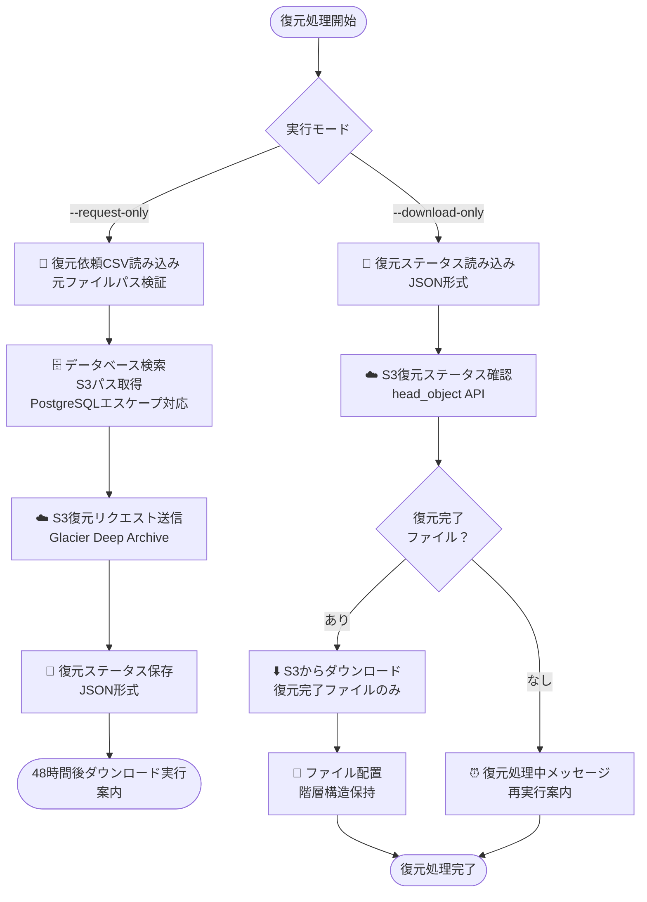

## 1. システム概要

### 1.1 システム目的

企業内ファイルサーバ（FSx for Windows File Server）上のファイルを、ユーザー依頼に基づいて AWS S3（Glacier Deep Archive）にアーカイブし、履歴管理・復元・削除機能を提供する。

### 1.2 システム構成図


### 1.3 技術スタック

- **処理サーバ**: AWS EC2（4vCPU、16GB メモリ、PostgreSQL・Streamlit 相乗り）
- **言語**: Python 3.13
- **データベース**: PostgreSQL 13 以上（EC2 内）
- **Web アプリ**: Streamlit 1.28 以上（EC2 内）
- **AWS 連携**: boto3、AWS CLI
- **ファイルサーバ**: FSx for Windows File Server（AWS 環境内）
- **テストフレームワーク**: pytest、pytest-cov

## 2. 実装状況と検証結果

### 2.1 実装完了項目

#### 2.1.1 アーカイブスクリプト（archive_script_main.py）

- ✅ **CSV 読み込み・検証処理**: UTF-8-SIG 対応、エラー項目記録
- ✅ **ファイル収集処理**: os.walk()による再帰的収集
- ✅ **S3 アップロード処理**: boto3、VPC エンドポイント対応
- ✅ **ストレージクラス自動変換**: GLACIER_DEEP_ARCHIVE → DEEP_ARCHIVE
- ✅ **アーカイブ後処理**: 元ファイル削除（空ファイル作成廃止）
- ✅ **データベース登録**: PostgreSQL、トランザクション管理
- ✅ **エラーハンドリング**: 再試行可能 CSV フォーマット出力
- ✅ **ディレクトリリネーム**: アーカイブ完了後の自動リネーム機能

#### 2.1.2 復元スクリプト（restore_script_main.py）

- ✅ **CSV 読み込み・検証処理**: 元ファイルパス+復元先ディレクトリ
- ✅ **データベース検索**: S3 パス取得（PostgreSQL エスケープ対応）
- ✅ **2 段階実行モード**: --request-only / --download-only
- ✅ **S3 復元リクエスト**: restore_object API
- ✅ **復元ステータス確認**: head_object API
- ✅ **復元ステータス管理**: JSON 形式でのステータス保存・読み込み
- ✅ **ダウンロード・配置処理**: 同名ファイルスキップ、0 バイトファイル対応
- ✅ **一時ファイル管理**: 安全なダウンロード・クリーンアップ
- ✅ **階層構造保持**: 相対パス計算による正確な復元先配置

#### 2.1.3 削除スクリプト（delete_script_main.py）

- ✅ **CSV 読み込み・検証処理**: UTF-8-SIG 対応、パス存在確認
- ✅ **削除前確認機能**: 削除対象リスト表示、ユーザー確認
- ✅ **安全な削除実行**: ファイル・ディレクトリの削除、権限チェック
- ✅ **ドライランモード**: 実際の削除を行わない確認機能
- ✅ **エラーハンドリング**: 削除失敗時の適切なログ出力
- ✅ **シンプル設計**: 履歴管理不要、パス指定のみの削除

#### 2.1.4 Streamlit アプリ（streamlit_app.py）

- ✅ **基本画面構成**: ヘッダー、サイドバー、メインエリア
- ✅ **検索・フィルタリング**: 日付範囲、依頼者、ファイルパス
- ✅ **データベース接続**: PostgreSQL、SQLAlchemy 対応
- ✅ **統計情報表示**: ファイル数、サイズ、依頼件数
- ✅ **データテーブル表示**: ページネーション、詳細表示
- ✅ **エクスポート機能**: Excel、CSV 形式
- ✅ **セッション状態管理**: 検索結果保持、初期画面リセット
- ✅ **ブラウザ互換性**: Edge 93 以降対応

### 2.2 検証済み機能

#### 2.2.1 動作確認済み環境

- **OS**: Windows Server 2022
- **Python**: 3.13
- **Streamlit**: 1.46
- **ブラウザ**: Microsoft Edge 93 以降

#### 2.2.2 確認済み機能

- **0 バイトファイル処理**: S3 アップロード・ダウンロード
- **VPC エンドポイント通信**: S3 との通信
- **データベース操作**: PostgreSQL CRUD 操作
- **エラーハンドリング**: 各種エラーパターン
- **ログ出力**: 処理状況・エラー情報
- **PostgreSQL エスケープ**: バックスラッシュを含むパス検索
- **階層構造保持**: 復元時のディレクトリ構造維持
- **削除機能**: ファイル・ディレクトリの安全な削除

### 2.3 解決済み技術的課題

#### 2.3.1 SQLAlchemy 2.0 互換性問題

**問題**: 生 SQL 文字列の直接実行が非対応
**対策**: `text()`でのラップが必要

```python
# 修正前
conn.execute("SELECT 1")

# 修正後
from sqlalchemy import text
conn.execute(text("SELECT 1"))
```

#### 2.3.2 PostgreSQL エスケープ問題

**問題**: バックスラッシュを含むパスの LIKE 検索が失敗
**対策**: 二重エスケープ処理の実装

```python
# 修正前
escaped_path = normalized_path.replace('\\', '\\')

# 修正後
escaped_path = normalized_path.replace('\\', '\\\\')
```

#### 2.3.3 Streamlit API 変更

**問題**: `st.experimental_rerun()`の廃止
**対策**: `st.rerun()`への統一

```python
# 修正前
st.experimental_rerun()

# 修正後
st.rerun()
```

#### 2.3.4 ブラウザ互換性問題

**問題**: `Object.hasOwn()`が Edge 86 で未対応
**対策**: Edge 93 以降への更新が必要

## 3. データベース設計

### 3.1 テーブル設計

#### 3.1.1 archive_history テーブル

| カラム名           | データ型    | 制約                                | 説明                     |
| ------------------ | ----------- | ----------------------------------- | ------------------------ |
| id                 | BIGSERIAL   | PRIMARY KEY                         | 主キー（自動採番）       |
| request_id         | VARCHAR(50) | NOT NULL                            | 依頼 ID                  |
| requester          | VARCHAR(8)  | NOT NULL, CHECK                     | 依頼者（社員番号 8 桁）  |
| request_date       | TIMESTAMP   | NOT NULL, DEFAULT CURRENT_TIMESTAMP | 依頼日時                 |
| approval_date      | TIMESTAMP   |                                     | 承認日時                 |
| original_file_path | TEXT        | NOT NULL                            | 元ファイルパス           |
| s3_path            | TEXT        | NOT NULL                            | S3 パス                  |
| archive_date       | TIMESTAMP   | NOT NULL                            | アーカイブ日時           |
| file_size          | BIGINT      | CHECK >= 0                          | ファイルサイズ（バイト） |
| created_at         | TIMESTAMP   | NOT NULL, DEFAULT CURRENT_TIMESTAMP | 作成日時                 |
| updated_at         | TIMESTAMP   | NOT NULL, DEFAULT CURRENT_TIMESTAMP | 更新日時                 |

**注意**: S3 アップロード成功時のみ記録

### 3.2 インデックス設計

```sql
-- 検索用インデックス
CREATE INDEX idx_archive_history_requester ON archive_history(requester);
CREATE INDEX idx_archive_history_request_date ON archive_history(request_date);
CREATE INDEX idx_archive_history_request_id ON archive_history(request_id);

-- ファイルパス検索用（復元処理で使用）
CREATE INDEX idx_archive_history_original_file_path ON archive_history USING gin(original_file_path gin_trgm_ops);

-- 複合インデックス
CREATE INDEX idx_archive_history_requester_date ON archive_history(requester, request_date);
```

### 3.3 データベース運用

#### 3.3.1 接続設定

```json
{
  "database": {
    "host": "localhost",
    "port": 5432,
    "database": "archive_system",
    "user": "postgres",
    "password": "secure_password",
    "timeout": 30
  }
}
```

#### 3.3.2 パフォーマンス最適化

- **バッチ挿入**: executemany()使用
- **トランザクション管理**: with 文による autocommit 制御
- **インデックス活用**: 検索条件に応じたインデックス設計

## 4. アーカイブスクリプト詳細設計

### 4.1 処理フロー


### 4.2 ArchiveProcessor クラス設計

#### 4.2.1 主要メソッド

```python
class ArchiveProcessor:
    def __init__(config_path: str)
    def load_config(config_path: str) -> Dict
    def setup_logger() -> logging.Logger
    def validate_csv_input(csv_path: str) -> Tuple[List[str], List[Dict]]
    def _validate_directory_path_with_details(path: str) -> Dict
    def collect_files(directories: List[str]) -> List[Dict]
    def archive_to_s3(files: List[Dict]) -> List[Dict]
    def _initialize_s3_client() -> boto3.client
    def _validate_storage_class(storage_class: str) -> str
    def _generate_s3_key(file_path: str) -> str
    def _upload_file_with_retry(...) -> Dict
    def create_archived_files(results: List[Dict]) -> List[Dict]
    def rename_archived_directories(results: List[Dict]) -> None
    def save_to_database(results: List[Dict]) -> None
    def generate_csv_error_file(csv_path: str) -> Optional[str]
    def generate_error_csv(failed_items: List[Dict], csv_path: str) -> Optional[str]
    def run(csv_path: str, request_id: str) -> int
```

#### 4.2.2 S3 キー生成ロジック

```python
def _generate_s3_key(self, file_path: str) -> str:
    """サーバ名ベースのS3キー生成"""
    # UNCパス: \\server\share\path\file.txt → server/share/path/file.txt
    # ドライブレター: C:\path\file.txt → local_c/path/file.txt
```

### 4.3 エラーハンドリング

#### 4.3.1 エラー分類と対応

| エラー種別             | 処理継続 | リトライ | 出力ファイル |
| ---------------------- | -------- | -------- | ------------ |
| CSV 読み込みエラー     | ×        | -        | -            |
| CSV 検証エラー         | ✓        | -        | CSV 再試行用 |
| S3 接続エラー          | ×        | -        | -            |
| S3 操作エラー          | ✓        | ✓        | CSV 再試行用 |
| ファイルアクセスエラー | ✓        | ×        | CSV 再試行用 |
| データベース接続エラー | ✓        | ×        | -            |

#### 4.3.2 エラー CSV 出力

- **CSV 検証エラー**: `logs/{元ファイル名}_csv_retry_{timestamp}.csv`
- **アーカイブエラー**: `logs/{元ファイル名}_archive_retry_{timestamp}.csv`

## 5. 復元スクリプト詳細設計

### 5.1 処理フロー



### 5.2 RestoreProcessor クラス設計

#### 5.2.1 主要メソッド

```python
class RestoreProcessor:
    def __init__(config_path: str)
    def load_config(config_path: str) -> Dict
    def setup_logger() -> logging.Logger
    def validate_csv_input(csv_path: str) -> Tuple[List[Dict], List[Dict]]
    def _validate_restore_request(original_file_path: str, restore_dir: str, restore_mode: str) -> Dict
    def lookup_files_from_database(restore_requests: List[Dict]) -> List[Dict]
    def _generate_search_patterns(restore_path: str) -> List[str]
    def _calculate_relative_path(original_path: str, restore_path: str, restore_mode: str) -> str
    def request_restore(restore_requests: List[Dict]) -> List[Dict]
    def check_restore_completion(restore_requests: List[Dict]) -> List[Dict]
    def download_and_place_files(restore_requests: List[Dict]) -> List[Dict]
    def _download_file_with_retry(...) -> Dict
    def _place_file_to_destination(temp_path: str, destination_path: str) -> Dict
    def _save_restore_status(restore_requests: List[Dict]) -> None
    def _load_restore_status() -> List[Dict]
    def run(csv_path: str, request_id: str, mode: str) -> int
```

### 5.3 復元ステータス管理

#### 5.3.1 ステータスファイル形式

**ファイル名**: `logs/restore_status_{request_id}.json`

```json
{
  "request_id": "REQ-2025-001",
  "request_date": "2025-07-16T10:30:00",
  "total_requests": 10,
  "restore_requests": [
    {
      "line_number": 2,
      "original_file_path": "\\\\server\\share\\file.txt",
      "restore_directory": "C:\\restored\\",
      "s3_path": "s3://bucket/server/share/file.txt",
      "bucket": "bucket",
      "key": "server/share/file.txt",
      "restore_status": "completed",
      "restore_request_time": "2025-07-16T10:30:15",
      "restore_completed_time": "2025-07-18T14:20:00",
      "restore_expiry": "Fri, 25 Jul 2025 14:20:00 GMT",
      "download_status": "completed",
      "destination_path": "C:\\restored\\file.txt",
      "downloaded_size": 1024,
      "relative_path": "subdir\\file.txt"
    }
  ]
}
```

#### 5.3.2 復元ステータス遷移

```
requested → pending → in_progress → completed → downloaded
                                  → failed
```

### 5.4 PostgreSQL エスケープ対応

#### 5.4.1 検索パターン生成

```python
def _generate_search_patterns(self, restore_path: str) -> List[str]:
    """PostgreSQLエスケープ対応の検索パターン生成"""
    # \\ -> \\\\（PostgreSQLでは二重エスケープが必要）
    escaped_path = normalized_path.replace('\\', '\\\\')

    patterns = []
    if normalized_path.endswith('\\'):
        patterns.append(f"{escaped_path}%")
    else:
        patterns.append(f"{escaped_path}\\\\%")

    return patterns
```

### 5.5 階層構造保持機能

#### 5.5.1 相対パス計算（修正版）

```python
def _calculate_relative_path(self, original_path: str, restore_path: str, restore_mode: str) -> str:
    """階層構造保持のための相対パス計算"""
    if restore_mode == 'file':
        return os.path.basename(original_path)
    else:
        # ディレクトリ復元時の階層構造保持
        orig_normalized = original_path.replace('/', '\\').rstrip('\\')
        restore_normalized = restore_path.replace('/', '\\').rstrip('\\')

        orig_lower = orig_normalized.lower()
        restore_lower = restore_normalized.lower()

        if orig_lower.startswith(restore_lower + '\\'):
            relative = orig_normalized[len(restore_normalized) + 1:]
            return relative if relative else os.path.basename(original_path)
        else:
            # 代替計算による柔軟な相対パス生成
            return self._alternative_relative_calculation(orig_normalized, restore_normalized)
```

## 6. 削除スクリプト詳細設計

### 6.1 処理フロー


### 6.2 SimpleDeletionProcessor クラス設計

#### 6.2.1 主要メソッド

```python
class SimpleDeletionProcessor:
    def __init__(config_path: str)
    def load_config(config_path: str) -> Dict
    def setup_logger() -> logging.Logger
    def read_deletion_paths(csv_path: str) -> List[str]
    def delete_paths(paths: List[str], dry_run: bool = False) -> Dict
    def run(csv_path: str, dry_run: bool = False, skip_confirmation: bool = False) -> int
```

#### 6.2.2 削除処理の特徴

**安全機能:**

- 削除前のパス存在確認
- 削除前のユーザー確認プロンプト
- ドライランモード（`--dry-run`）による事前確認
- 削除権限の事前チェック

**シンプル設計:**

- データベース連携なし
- 削除履歴管理なし
- サイズ計算・表示なし
- パス指定のみの単純削除

### 6.3 削除依頼 CSV 仕様

#### 6.3.1 CSV フォーマット

```csv
削除対象パス
\\server\project2\
C:\restored\file.txt
\\amznfsxbeak7dyp.priv-req-gl01.fujifilm-intra.com\test\project3\
```

#### 6.3.2 対応パス形式

- **UNC パス**: `\\server\share\folder\`
- **ローカルパス**: `C:\folder\file.txt`
- **ファイル・ディレクトリ**: 両方対応

### 6.4 実行オプション

#### 6.4.1 コマンドライン引数

```bash
# 通常削除
python delete_script_main.py deletion_paths.csv

# ドライラン（削除せずに確認のみ）
python delete_script_main.py deletion_paths.csv --dry-run

# 確認スキップ（自動実行）
python delete_script_main.py deletion_paths.csv --skip-confirmation
```

### 6.5 削除運用フロー

#### 6.5.1 運用方針

**削除タイミング:**

- 利用者の判断に委ねる
- 復元後の利用期間制限なし

**削除対象:**

- フォルダベースでの削除が基本
- ファイル単位の削除は個別相談

**承認プロセス:**

- FAST ワークフローでの承認
- 削除依頼者と復元依頼者の厳密な一致確認は不要

**安全性:**

- S3 アーカイブデータは保持（再復元可能）
- 削除対象の特定は利用者責任

#### 6.5.2 削除対象の特定方法

利用者は以下の方法で復元されたフォルダを特定：

1. **FAST での復元依頼履歴確認**

   - 過去の復元依頼内容を確認
   - 復元先ディレクトリの特定

2. **Streamlit アプリでのアーカイブ履歴確認**
   - アーカイブされたファイルの元パス確認
   - 復元対象ファイルの特定支援

## 7. Streamlit アプリケーション設計

### 7.1 画面構成

#### 7.1.1 メイン画面レイアウト

```
┌─────────────────────────────────────────────────────┐
│  📁 アーカイブ履歴管理システム                      │
│  最終更新: 2025年07月17日 13:00:32                  │
│  [🔄 初期画面に戻る] ←検索実行後のみ表示           │
├─────────────────────────────────────────────────────┤
│ サイドバー                    │ メインエリア        │
│ ┌─────────────────────────────┐ │ ┌─────────────────│
│ │ 🔍 検索条件                │ │ │ 📊 統計情報     │
│ │ ┌─────────────────────────┐ │ │ │ ┌─────────────│
│ │ │ 期間指定                │ │ │ │ │ 総ファイル数│
│ │ │ 開始日 [2025-06-17]    │ │ │ │ │ 総サイズ    │
│ │ │ 終了日 [2025-07-17]    │ │ │ │ │ 依頼件数    │
│ │ └─────────────────────────┘ │ │ │ └─────────────│
│ │ 依頼ID                     │ │ │ 📋 履歴一覧     │
│ │ 依頼者                     │ │ │ [データテーブル]│
│ │ ファイル検索               │ │ │ 📥 エクスポート │
│ │ 表示件数                   │ │ │ [Excel] [CSV]  │
│ │ [🔍 検索実行]             │ │ │                 │
│ └─────────────────────────────┘ │ └─────────────────│
└─────────────────────────────────────────────────────┘
```

#### 7.1.2 主要コンポーネント

**ArchiveHistoryApp クラス**

```python
class ArchiveHistoryApp:
    def __init__(self)
    def load_config(self) -> Dict
    def get_database_engine(self)
    def search_archive_history(...) -> pd.DataFrame
    def get_statistics(...) -> Dict
    def get_requester_list(self) -> List[str]
    def format_file_size(self, size_bytes: int) -> str
    def create_download_link(self, df: pd.DataFrame, filename: str, file_format: str) -> str
    def render_header(self)
    def render_sidebar_filters(self)
    def render_statistics(self, stats: Dict)
    def render_data_table(self, df: pd.DataFrame)
    def render_export_section(self, df: pd.DataFrame)
    def render_initial_screen(self)
    def run(self)
```

### 7.2 セッション状態管理

#### 7.2.1 セッション変数

```python
# 検索実行状態
st.session_state.search_executed = False

# 検索結果保持
st.session_state.search_results = pd.DataFrame()
st.session_state.search_stats = {}

# 検索パラメータ保持
st.session_state.last_search_params = {}
```

#### 7.2.2 状態遷移

```
初期画面 → 検索実行 → 結果表示 → 初期画面リセット
```

### 7.3 データベース連携

#### 7.3.1 検索クエリ最適化

```sql
-- 基本検索（インデックス活用）
SELECT id, request_id, requester, request_date,
       original_file_path, s3_path, archive_date, file_size
FROM archive_history
WHERE request_date::date BETWEEN %s AND %s
ORDER BY request_date DESC
LIMIT %s OFFSET %s;

-- 統計情報取得
SELECT COUNT(*) as total_files,
       SUM(file_size) as total_size,
       COUNT(DISTINCT request_id) as total_requests
FROM archive_history
WHERE request_date::date BETWEEN %s AND %s;
```

#### 7.3.2 SQLAlchemy 対応

```python
# 修正済みパターン
from sqlalchemy import text
result = conn.execute(text(query), params)
```

## 8. 設定管理

### 8.1 共通設定ファイル

**config/archive_config.json**

```json
{
  "aws": {
    "region": "ap-northeast-1",
    "s3_bucket": "your-archive-bucket",
    "storage_class": "DEEP_ARCHIVE",
    "vpc_endpoint_url": "https://bucket.vpce-xxx.s3.region.vpce.amazonaws.com"
  },
  "database": {
    "host": "localhost",
    "port": 5432,
    "database": "archive_system",
    "user": "postgres",
    "password": "secure_password",
    "timeout": 30
  },
  "request": {
    "requester": "12345678"
  },
  "file_server": {
    "archived_suffix": "_archived",
    "exclude_extensions": [".tmp", ".lock", ".bak"]
  },
  "processing": {
    "max_file_size": 10737418240,
    "retry_count": 3
  },
  "restore": {
    "restore_tier": "Standard",
    "restore_days": 7,
    "download_retry_count": 3,
    "skip_existing_files": true,
    "temp_download_directory": "temp_downloads"
  },
  "logging": {
    "log_directory": "logs"
  }
}
```

### 8.2 削除設定項目

**最適化により削除された設定項目:**

- `chunk_size`: 全スクリプトで未使用のため削除
- `log_level`: 全スクリプトでハードコード（INFO 固定）のため削除

### 8.3 環境別設定

#### 8.3.1 開発環境

- オンプレミス検証用
- 設定ファイル: `config/dev_config.json`

#### 8.3.2 本番環境

- AWS EC2 + PostgreSQL（EC2 内） + S3
- 設定ファイル: `config/prod_config.json`

## 9. 運用・監視設計

### 9.1 ログ管理

#### 9.1.1 ログ出力形式

```
[2025-07-18 10:36:04] [INFO] Streamlit process started (PID: 2104)
[2025-07-18 10:36:11] [INFO] Health check successful at 5 seconds
[2025-07-18 10:36:11] [INFO] === Streamlit Service Started Successfully ===
```

#### 9.1.2 ログ管理方針

- **出力先**: `logs/` ディレクトリ
- **命名規則**: 日付・時刻ベースのファイル名
- **レベル**: INFO、WARNING、ERROR
- **自動削除**: 実装なし（手動管理）

### 9.2 エラー処理・ログ出力

#### 9.2.1 エラー処理対象

- **処理失敗**: S3 接続エラー、ファイルアクセスエラー
- **処理時間**: 想定時間を大幅に超過した場合
- **システムリソース**: ディスク容量不足など

#### 9.2.2 ログ出力機能

- **エラーログ**: 詳細なエラー情報をファイル出力
- **統計ログ**: 処理件数、処理時間、成功・失敗件数
- **デバッグログ**: 詳細な処理状況（デバッグレベル）

### 9.3 Windows Server サービス化（実装完了）

#### 9.3.1 推奨方法

**PowerShell + タスクスケジューラ**（実装済み）

- ✅ 標準機能のみ使用
- ✅ 自動再起動機能
- ✅ 健全性チェック機能
- ✅ 詳細ログ出力機能

#### 9.3.2 サービス管理

```powershell
# サービス開始
Start-ScheduledTask -TaskName "ArchiveHistoryStreamlitService"

# サービス停止
Stop-ScheduledTask -TaskName "ArchiveHistoryStreamlitService"

# 状態確認
Get-ScheduledTask -TaskName "ArchiveHistoryStreamlitService"

# ログ確認
Get-Content "C:\temp\archive\archive_system\logs\service\streamlit_service_$(Get-Date -Format 'yyyyMMdd').log" -Tail 20
```

## 10. セキュリティ設計

### 10.1 認証・認可

#### 10.1.1 アクセス制御

- **運用管理者**: 全機能アクセス可能
- **依頼者**: 企業社員番号 8 桁による識別
- **ファイルアクセス**: 部署ごとに独立したファイルサーバ構成

#### 10.1.2 AWS 認証

```json
{
  "aws_authentication": {
    "method": "IAM_ROLE",
    "role_arn": "arn:aws:iam::123456789012:role/ArchiveSystemRole",
    "permissions": [
      "s3:GetObject",
      "s3:PutObject",
      "s3:RestoreObject",
      "s3:ListBucket"
    ]
  }
}
```

### 10.2 データ保護

#### 10.2.1 通信暗号化

- **S3 通信**: VPC エンドポイント経由の HTTPS
- **データベース**: 同一 EC2 内のローカル接続
- **Streamlit**: HTTP 接続（EC2 内アクセス）

#### 10.2.2 ログ保護

```python
# 機密情報のマスキング
def mask_sensitive_data(log_message: str) -> str:
    # パスワード、認証情報のマスキング
    masked = re.sub(r'password["\s]*[:=]["\s]*[^"]*', 'password=***', log_message)
    return masked
```

### 10.3 監査ログ

#### 10.3.1 記録対象

- **アクセスログ**: Streamlit アプリへのアクセス
- **操作ログ**: アーカイブ・復元・削除処理の実行
- **システムログ**: エラー・警告・重要イベント

#### 10.3.2 ログ管理方針

- **自動削除**: 実装なし（手動管理）
- **保持期間**: 運用者による手動管理
- **アーカイブ**: 必要に応じて手動実施

## 11. パフォーマンス設計

### 11.1 処理能力

#### 11.1.1 想定処理量

- **月間依頼件数**: 100-200 件
- **月間処理ファイル数**: 10,000-20,000 ファイル
- **最大ファイルサイズ**: 10GB
- **同時実行**: なし（シーケンシャル処理）

#### 11.1.2 処理時間目安

- **アーカイブ処理**: 1GB 当たり 5-10 分
- **復元リクエスト**: 1 ファイル当たり 1-2 秒
- **復元完了**: 48 時間以内（AWS 仕様）
- **ダウンロード**: 1GB 当たり 2-5 分
- **削除処理**: 1 ファイル当たり 1 秒未満

### 11.2 最適化ポイント

#### 11.2.1 S3 転送最適化

```python
# チャンクサイズ最適化
CHUNK_SIZE = 8 * 1024 * 1024  # 8MB

# マルチパート設定
from boto3.s3.transfer import TransferConfig
s3_client.upload_file(
    file_path,
    bucket_name,
    s3_key,
    Config=TransferConfig(
        multipart_threshold=1024 * 25,  # 25MB
        max_concurrency=10,
        multipart_chunksize=1024 * 25,
        use_threads=True
    )
)
```

#### 11.2.2 データベース最適化

```python
# バッチ挿入
cursor.executemany(insert_query, batch_data)

# インデックス活用
SELECT * FROM archive_history
WHERE request_date::date BETWEEN %s AND %s
ORDER BY request_date DESC;
```

### 11.3 システムリソース管理

#### 11.3.1 リソース利用方針

- **CPU 使用率**: 処理性能優先（上限設定なし）
- **メモリ使用量**: EC2 インスタンスサイズに依存
- **ディスク使用量**: 一時作業領域の手動監視

#### 11.3.2 運用監視

- **手動確認**: 定期的な処理状況確認
- **ログベース**: 処理ログでの状況把握
- **必要時対応**: 問題発生時の手動対処

## 12. 今後の拡張計画

### 12.1 短期拡張（3 ヶ月以内）

#### 12.1.1 完了済み項目

- [x] CSV 検証エラー処理の改善
- [x] S3 アップロード機能の実装
- [x] エラーハンドリングの強化
- [x] S3 パス構造の改善
- [x] アーカイブ後処理の実装
- [x] データベース登録処理の実装
- [x] 復元スクリプトの基盤実装
- [x] 復元リクエスト送信機能の実装
- [x] 復元ステータス確認機能の実装
- [x] 復元ステータス管理機能の実装
- [x] 2 段階実行モードの実装
- [x] ダウンロード・配置機能の実装
- [x] 一時ファイル管理機能の実装
- [x] 実機動作検証完了
- [x] Streamlit アプリの基本実装
- [x] Windows Server サービス化完了
- [x] 技術的課題の解決（SQLAlchemy 2.0 対応、ブラウザ互換性等）
- [x] PostgreSQL エスケープ問題の解決
- [x] 階層構造保持機能の実装
- [x] 削除スクリプトの実装
- [x] 削除運用フローの確定
- [x] 設定ファイルの最適化（未使用項目削除）

#### 12.1.2 残作業

- [ ] 単体テストコードの実装
- [ ] EC2 環境での統合テスト
- [ ] 本番環境構築

### 12.2 中期拡張（6 ヶ月以内）

#### 12.2.1 機能拡張

- [ ] 並行処理対応
- [ ] パフォーマンス最適化
- [ ] 進捗確認機能の実装

#### 12.2.2 運用改善

- [ ] 自動化スクリプト
- [ ] 運用手順書の詳細化
- [ ] トラブルシューティングガイド

### 12.3 長期拡張（1 年以内）

#### 12.3.1 高度な機能

- [ ] WebUI での依頼受付機能
- [ ] 自動スケジューリング機能
- [ ] レポート機能の拡充
- [ ] API 化

#### 12.3.2 運用効率化

- [ ] 機械学習による異常検知
- [ ] 自動復旧機能
- [ ] 容量予測機能

## 13. 開発・テスト計画

### 13.1 テスト環境

#### 13.1.1 開発環境

- **OS**: Windows Server 2022
- **データベース**: PostgreSQL 13 (ローカル)
- **ストレージ**: ローカルファイルシステム
- **目的**: 機能開発・単体テスト

#### 13.1.2 統合テスト環境

- **OS**: AWS EC2 (Windows Server 2022)
- **データベース**: PostgreSQL（EC2 内）
- **ストレージ**: Amazon S3
- **目的**: 統合テスト・性能テスト

### 13.2 テストケース

#### 13.2.1 単体テスト

```python
def test_csv_validation():
    """CSV検証機能のテスト"""
    # 正常ケース
    # 異常ケース（不正パス、権限エラー等）

def test_s3_upload():
    """S3アップロード機能のテスト"""
    # 正常ケース
    # 異常ケース（接続エラー、権限エラー等）

def test_file_restoration():
    """ファイル復元機能のテスト"""
    # 正常ケース
    # 異常ケース（ファイル不存在、権限エラー等）

def test_file_deletion():
    """ファイル削除機能のテスト"""
    # 正常ケース
    # 異常ケース（権限エラー、パス不存在等）
```

#### 13.2.2 統合テスト

- **エンドツーエンドテスト**: アーカイブ → 復元 → 削除の完全フロー
- **負荷テスト**: 大量ファイル処理
- **障害テスト**: ネットワーク断、システム障害

### 13.3 品質保証

#### 13.3.1 コード品質

- **コードレビュー**: 全変更のレビュー必須
- **静的解析**: pylint、flake8 の実行
- **テストカバレッジ**: 80%以上

#### 13.3.2 ドキュメント品質

- **設計書**: 実装との整合性確認
- **運用手順書**: 実機での手順検証
- **トラブルシューティング**: 想定障害シナリオ

## 14. 移行計画

### 14.1 段階的移行

#### 14.1.1 Phase 1: 基盤構築

- AWS 環境構築（EC2、S3、FSx for Windows File Server）
- ネットワーク設定（VPC、エンドポイント）
- 基本アプリケーションデプロイ

#### 14.1.2 Phase 2: 機能検証

- 小規模データでの動作確認
- 各機能の単体テスト
- 統合テストの実施

#### 14.1.3 Phase 3: 本格運用

- 大規模データでの負荷テスト
- 運用手順の確定
- 本番環境での運用開始

### 14.2 移行チェックリスト

#### 14.2.1 技術的要件

- [ ] AWS 環境構築完了
- [ ] アプリケーションデプロイ完了
- [ ] データベース設定完了（EC2 内 PostgreSQL）
- [ ] ネットワーク設定完了
- [ ] セキュリティ設定完了

#### 14.2.2 運用要件

- [ ] 運用手順書完成
- [ ] バックアップ設定完了
- [ ] 障害対応手順完成
- [ ] 運用者トレーニング完了

## 15. 運用手順書

### 15.1 アーカイブ処理手順

#### 15.1.1 事前準備

```bash
# 1. 設定ファイル確認
python -c "import json; print(json.load(open('config/archive_config.json')))"

# 2. CSVファイル準備確認
head -5 archive_request.csv

# 3. ログディレクトリ確認
ls -la logs/
```

#### 15.1.2 実行手順

```bash
# 1. アーカイブ処理実行
python archive_script_main.py archive_request.csv REQ-2025-001

# 2. 処理結果確認
tail -20 logs/archive_*.log

# 3. エラー発生時の対応
ls logs/*retry*.csv  # 再試行用CSVの確認
```

### 15.2 復元処理手順

#### 15.2.1 復元リクエスト送信

```bash
# 1. 復元リクエスト送信
python restore_script_main.py restore_request.csv REQ-RESTORE-001 --request-only

# 2. ステータスファイル確認
cat logs/restore_status_REQ-RESTORE-001.json
```

#### 15.2.2 ダウンロード実行（48 時間後）

```bash
# 1. ダウンロード実行
python restore_script_main.py restore_request.csv REQ-RESTORE-001 --download-only

# 2. 復元結果確認
ls -la /restored/files/
```

### 15.3 削除処理手順

#### 15.3.1 削除実行

```bash
# 1. ドライラン（確認のみ）
python delete_script_main.py deletion_request.csv --dry-run

# 2. 削除実行
python delete_script_main.py deletion_request.csv

# 3. 処理結果確認
tail -20 logs/deletion_*.log
```

### 15.4 Streamlit アプリ運用

#### 15.4.1 手動起動

```bash
# 1. アプリ起動
streamlit run streamlit_app.py --server.port 8501

# 2. ブラウザでアクセス
# http://localhost:8501
```

#### 15.4.2 サービス起動（Windows Server）

```powershell
# 1. サービス開始
Start-ScheduledTask -TaskName "ArchiveHistoryStreamlitService"

# 2. 状態確認
Get-ScheduledTask -TaskName "ArchiveHistoryStreamlitService"

# 3. ログ確認
Get-Content "logs\service\streamlit_service_$(Get-Date -Format 'yyyyMMdd').log" -Tail 20
```

## 16. トラブルシューティング

### 16.1 よくある問題と対処法

#### 16.1.1 データベース接続エラー

**症状**: `psycopg2.OperationalError: could not connect to server`
**原因**: データベースサーバの停止、接続設定の誤り
**対処法**:

```bash
# 1. データベース状態確認
pg_isready -h localhost -p 5432

# 2. 接続設定確認
cat config/archive_config.json | grep database

# 3. PostgreSQLサービス確認
sudo systemctl status postgresql
```

#### 16.1.2 S3 接続エラー

**症状**: `botocore.exceptions.EndpointConnectionError`
**原因**: VPC エンドポイント設定、IAM 権限の問題
**対処法**:

```bash
# 1. IAM権限確認
aws sts get-caller-identity

# 2. S3接続テスト
aws s3 ls s3://your-bucket --endpoint-url https://vpce-xxx.s3.region.vpce.amazonaws.com

# 3. VPCエンドポイント確認
aws ec2 describe-vpc-endpoints
```

#### 16.1.3 Streamlit アプリエラー

**症状**: ブラウザで画面が表示されない
**原因**: ポート競合、ファイアウォール設定
**対処法**:

```bash
# 1. ポート使用状況確認
netstat -an | grep 8501

# 2. プロセス確認
ps aux | grep streamlit

# 3. ファイアウォール確認（Windows）
netsh advfirewall firewall show rule name="Streamlit"
```

### 16.2 ログ分析

#### 16.2.1 エラーログパターン

```bash
# 権限エラー
grep "Permission denied" logs/*.log

# ネットワークエラー
grep "Connection" logs/*.log

# S3エラー
grep "S3" logs/*.log | grep -i error
```

#### 16.2.2 パフォーマンス分析

```bash
# 処理時間の分析
grep "処理時間" logs/*.log | tail -10

# ファイルサイズ別の処理時間
grep "MB" logs/*.log | grep "アップロード"
```

## 17. 想定課題と対策

### 17.1 技術的課題

#### 17.1.1 ネットワーク関連

**課題**: VPC エンドポイント経由での S3 接続不安定
**対策**: 接続監視機能、自動再接続機能の実装

#### 17.1.2 ストレージ関連

**課題**: Glacier Deep Archive からの復元時間（48 時間）
**対策**: 復元計画の事前策定、優先度管理

### 17.2 運用課題

#### 17.2.1 容量管理

**課題**: 復元ファイルによるストレージ容量圧迫
**対策**: 削除運用フローの確立、定期的な容量監視

#### 17.2.2 運用負荷

**課題**: 手動運用による負荷
**対策**: 自動化機能の段階的導入

## 18. 結論

### 18.1 現在の達成状況

✅ **基本機能**: アーカイブ・復元・削除の完全なライフサイクル管理実装完了
✅ **動作確認**: 各種環境での動作確認完了
✅ **エラーハンドリング**: 主要エラーパターンの対応完了
✅ **ユーザインターフェース**: Streamlit アプリの基本機能実装完了
✅ **サービス化**: Windows Server での本格的なサービス化完了
✅ **技術課題解決**: SQLAlchemy 2.0 対応、PostgreSQL エスケープ問題等の解決完了
✅ **削除運用**: 復元ファイル削除による容量管理運用の確立完了

### 18.2 次のステップ

1. **EC2 環境での統合テスト**: 本番環境に近い条件での動作確認
2. **単体テスト実装**: 品質保証のためのテストコード作成
3. **本番環境構築**: AWS 環境での本格運用開始
4. **運用手順確定**: 実運用に向けた手順書作成

### 18.3 成功要因

- **段階的開発**: 機能ごとの段階的実装・検証
- **実機検証**: 実際の環境での動作確認
- **エラー対応**: 想定される各種エラーへの対応
- **ドキュメント整備**: 設計書・手順書の充実
- **問題解決**: トラブルシューティングを通じた品質向上
- **完全なライフサイクル管理**: アーカイブから削除まで一貫した運用体制

### 18.4 品質保証

- **コードレビュー**: 全機能の動作確認済み
- **エラーハンドリング**: 各種異常ケースへの対応済み
- **互換性**: 各種環境・ブラウザでの動作確認済み
- **セキュリティ**: IAM 権限・暗号化通信の実装済み
- **サービス化**: Windows 環境での永続稼働確認済み
- **削除運用**: 安全な削除機能と運用フローの確立済み

### 18.5 運用可能性

このシステムは、企業内ファイルアーカイブの要件を満たす実用的なソリューションとして設計・実装されており、**完全なライフサイクル管理（アーカイブ → 復元 → 削除）**を提供する**Windows Server 環境での本格運用**および**AWS EC2 環境での本番運用**に向けた準備が整っています。

特に以下の点で運用レベルに達しています：

- ✅ **安定性**: 自動再起動機能付きサービス化
- ✅ **監視性**: 詳細ログ出力・健全性チェック機能
- ✅ **保守性**: 標準的な管理コマンドでの制御
- ✅ **拡張性**: 設定変更による柔軟な運用調整
- ✅ **完全性**: アーカイブから削除まで一貫したライフサイクル管理# アーカイブシステム詳細設計書（修正版）
