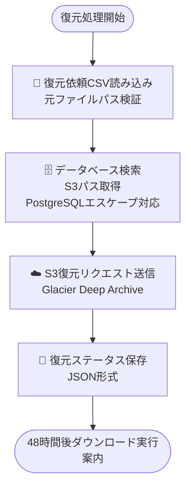
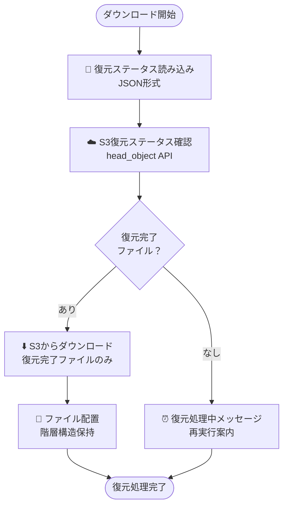

# 復元スクリプト仕様書（restore_script_main.py）

## 1. 概要

### 1.1 目的

AWS S3 Glacier Deep Archive からアーカイブされたファイルを、ユーザー依頼に基づいてファイルサーバへ復元し、階層構造を保持した状態で配置する。

### 1.2 実装状況

✅ **実装完了・実機検証済み**

- 2 段階実行モード（--request-only / --download-only）
- PostgreSQL エスケープ問題解決済み
- 階層構造保持機能対応
- ディレクトリ・ファイル混合復元対応
- 復元ステータス管理機能
- 0 バイトファイル対応

### 1.3 技術仕様

- **言語**: Python 3.13
- **依存ライブラリ**: boto3, psycopg2-binary, pathlib
- **データベース**: PostgreSQL 13 以上（読み取り専用）
- **ストレージ**: AWS S3 Glacier Deep Archive
- **設定ファイル**: config/archive_config.json

## 2. 処理フロー

### 2.1 復元リクエスト送信モード（--request-only）



### 2.2 ダウンロード実行モード（--download-only）



## 3. 入力仕様

### 3.1 コマンドライン実行形式

```bash
# 復元リクエスト送信
python restore_script_main.py <CSV_PATH> <REQUEST_ID> --request-only [--config CONFIG_PATH]

# ダウンロード実行
python restore_script_main.py <CSV_PATH> <REQUEST_ID> --download-only [--config CONFIG_PATH]
```

### 3.2 復元依頼 CSV 仕様（ディレクトリ・ファイル混合対応）

#### 3.2.1 基本フォーマット（2 列形式）

```csv
復元対象パス,復元先ディレクトリ
\\server\share\project1\file.txt,C:\restored\files\
\\server\share\project2\,D:\backup\restore\
\\server\share\archive\document.pdf,\\fileserver\shared\restored\
```

#### 3.2.2 拡張フォーマット（3 列形式）

```csv
復元対象パス,復元先ディレクトリ,復元モード
\\server\share\project1\file.txt,C:\restored\files\,file
\\server\share\project2\,D:\backup\restore\,directory
\\server\share\archive\,\\fileserver\shared\restored\,directory
```

### 3.3 復元モード判定

- **自動判定**: パスが区切り文字（\ /）で終われば`directory`、そうでなければ`file`
- **明示指定**: 3 列目で`file`または`directory`を指定可能

### 3.4 CSV 検証項目

- **ファイル形式**: UTF-8-SIG エンコーディング
- **カラム数**: 2 列または 3 列
- **復元対象パス**: 必須、データベース検索用
- **復元先ディレクトリ**: 存在確認、書き込み権限確認
- **復元モード**: file/directory のいずれか（自動判定または明示指定）

## 4. データベース検索仕様（PostgreSQL エスケープ対応）

### 4.1 検索パターン生成

```python
def _generate_search_patterns(self, restore_path: str) -> List[str]:
    """PostgreSQLエスケープ対応の検索パターン生成"""
    # バックスラッシュの二重エスケープ（PostgreSQL要求）
    escaped_path = normalized_path.replace('\\', '\\\\')

    patterns = []
    if normalized_path.endswith('\\'):
        patterns.append(f"{escaped_path}%")
        patterns.append(f"{escaped_path[:-2]}\\\\%")
    else:
        patterns.append(f"{escaped_path}\\\\%")
        patterns.append(f"{escaped_path}%")

    return patterns
```

### 4.2 検索方式

- **ファイル復元**: 完全一致検索（original_file_path = 指定パス）
- **ディレクトリ復元**: LIKE 検索（original_file_path LIKE パターン%）
- **代替検索**: パターン検索で見つからない場合のディレクトリ名部分検索

### 4.3 検索最適化

- **複数パターン**: 異なるエスケープ方法での検索
- **重複除去**: 同一ファイルの重複検出を自動除去
- **エラー処理**: 検索失敗時の詳細ログとデバッグ情報出力

## 5. 階層構造保持機能

### 5.1 相対パス計算（修正版）

```python
def _calculate_relative_path(self, original_path: str, restore_path: str, restore_mode: str) -> str:
    """階層構造保持のための相対パス計算"""
    if restore_mode == 'file':
        return os.path.basename(original_path)
    else:
        # ディレクトリ復元時の階層構造保持
        orig_normalized = original_path.replace('/', '\\').rstrip('\\')
        restore_normalized = restore_path.replace('/', '\\').rstrip('\\')

        if orig_normalized.lower().startswith(restore_normalized.lower() + '\\'):
            relative = orig_normalized[len(restore_normalized) + 1:]
            return relative if relative else os.path.basename(original_path)
        else:
            # 代替計算による柔軟な相対パス生成
            return self._alternative_relative_calculation(orig_normalized, restore_normalized)
```

### 5.2 配置先パス生成

```python
# ディレクトリ復元: 相対パスを使用して階層構造を保持
if restore_mode == 'directory':
    destination_path = os.path.join(restore_dir, relative_path)
else:
    # ファイル復元: ファイル名のみ
    filename = os.path.basename(original_path)
    destination_path = os.path.join(restore_dir, filename)

# 配置先ディレクトリの自動作成
destination_dir = os.path.dirname(destination_path)
os.makedirs(destination_dir, exist_ok=True)
```

## 6. 復元ステータス管理

### 6.1 ステータスファイル形式

**ファイル名**: `logs/restore_status_{request_id}.json`

```json
{
  "request_id": "REQ-RESTORE-001",
  "request_date": "2025-07-16T10:30:00",
  "total_requests": 10,
  "restore_requests": [
    {
      "line_number": 2,
      "original_file_path": "\\\\server\\share\\file.txt",
      "restore_directory": "C:\\restored\\",
      "restore_mode": "file",
      "s3_path": "s3://bucket/server/share/file.txt",
      "bucket": "bucket",
      "key": "server/share/file.txt",
      "restore_status": "completed",
      "restore_request_time": "2025-07-16T10:30:15",
      "restore_completed_time": "2025-07-18T14:20:00",
      "restore_expiry": "Fri, 25 Jul 2025 14:20:00 GMT",
      "download_status": "completed",
      "destination_path": "C:\\restored\\file.txt",
      "downloaded_size": 1024,
      "relative_path": "subdir\\file.txt"
    }
  ]
}
```

### 6.2 復元ステータス遷移

```
requested → pending → in_progress → completed → downloaded
                                  → failed
```

### 6.3 ステータス値詳細

| ステータス          | 説明                         | 次のアクション   |
| ------------------- | ---------------------------- | ---------------- |
| requested           | 復元リクエスト送信済み       | 待機             |
| already_in_progress | 既に復元処理中               | 待機             |
| pending             | 復元処理待機中               | 待機             |
| in_progress         | 復元処理中                   | 待機             |
| completed           | 復元完了（ダウンロード可能） | ダウンロード実行 |
| failed              | 復元失敗                     | 調査・再実行     |

## 7. S3 復元処理仕様

### 7.1 復元リクエスト送信

```python
s3_client.restore_object(
    Bucket=bucket,
    Key=key,
    RestoreRequest={
        'Days': 7,  # 復元後の保持日数
        'GlacierJobParameters': {
            'Tier': restore_tier  # Standard/Expedited/Bulk
        }
    }
)
```

### 7.2 復元ティア仕様

| ティア    | 復元時間  | コスト | 用途                     |
| --------- | --------- | ------ | ------------------------ |
| Standard  | 3-5 時間  | 中程度 | **推奨**：通常の復元作業 |
| Expedited | 1-5 分    | 高額   | 緊急時のみ               |
| Bulk      | 5-12 時間 | 安価   | 大量ファイル・コスト重視 |

### 7.3 復元ステータス確認

```python
response = s3_client.head_object(Bucket=bucket, Key=key)
restore_header = response.get('Restore')

if 'ongoing-request="false"' in restore_header:
    # 復元完了
    file_info['restore_status'] = 'completed'
elif 'ongoing-request="true"' in restore_header:
    # 復元処理中
    file_info['restore_status'] = 'in_progress'
```

## 8. ファイルダウンロード・配置仕様

### 8.1 ダウンロード処理フロー

```python
def download_and_place_files(self, restore_requests: List[Dict]) -> List[Dict]:
    """ファイルダウンロード・配置処理（階層構造保持対応）"""

    # 復元完了ファイルのみ処理
    completed_files = [file_info for req in restore_requests
                      for file_info in req.get('files_found', [])
                      if file_info.get('restore_status') == 'completed']

    for file_info in completed_files:
        # 階層構造保持のための配置先パス生成
        if restore_mode == 'directory':
            destination_path = os.path.join(restore_dir, relative_path)
        else:
            filename = os.path.basename(original_path)
            destination_path = os.path.join(restore_dir, filename)

        # 配置先ディレクトリの作成
        os.makedirs(os.path.dirname(destination_path), exist_ok=True)

        # 同名ファイルスキップチェック
        if skip_existing and os.path.exists(destination_path):
            continue

        # 一時ダウンロード → 最終配置
        download_result = self._download_file_with_retry(...)
        placement_result = self._place_file_to_destination(...)
```

### 8.2 リトライ機能

- **対象**: S3 ダウンロードエラー
- **回数**: 最大 3 回（設定可能）
- **間隔**: 指数バックオフ（2^n 秒）
- **除外エラー**: NoSuchKey、AccessDenied、InvalidObjectState

### 8.3 一時ファイル管理

- **一時ディレクトリ**: `temp_downloads`（設定可能）
- **ファイル名**: `{timestamp}_{元ファイル名}`
- **自動クリーンアップ**: 処理完了後に自動削除

## 9. エラーハンドリング仕様

### 9.1 エラー分類と対応

| エラー種別             | 処理継続 | リトライ | 出力ファイル |
| ---------------------- | -------- | -------- | ------------ |
| CSV 読み込みエラー     | ×        | -        | -            |
| CSV 検証エラー         | ✓        | -        | エラー CSV   |
| データベース接続エラー | ×        | -        | -            |
| S3 接続エラー          | ×        | -        | -            |
| 復元リクエストエラー   | ✓        | ×        | -            |
| ダウンロードエラー     | ✓        | ✓        | -            |
| ファイル配置エラー     | ✓        | ×        | -            |

### 9.2 エラー CSV 出力

**復元依頼エラー**: `logs/{元ファイル名}_restore_errors_{timestamp}.csv`

```csv
行番号,内容,エラー理由,元の行
2,"\\invalid\path -> C:\restore","データベースにアーカイブ履歴が見つかりません","\\invalid\path,C:\restore"
```

**失敗ファイル用リトライ CSV**: `logs/{元ファイル名}_failed_retry_{timestamp}.csv`

```csv
復元対象パス,復元先ディレクトリ,復元モード,エラー段階,エラー理由
\\server\share\file.txt,C:\restore\,file,download,S3復元が完了していません
```

## 10. 設定ファイル仕様（最適化版）

### 10.1 config/archive_config.json

```json
{
  "aws": {
    "region": "ap-northeast-1",
    "s3_bucket": "your-archive-bucket",
    "storage_class": "DEEP_ARCHIVE",
    "vpc_endpoint_url": "https://s3.ap-northeast-1.amazonaws.com"
  },
  "database": {
    "host": "localhost",
    "port": 5432,
    "database": "archive_system",
    "user": "postgres",
    "password": "your_password",
    "timeout": 30
  },
  "restore": {
    "restore_tier": "Standard",
    "restore_days": 7,
    "download_retry_count": 3,
    "skip_existing_files": true,
    "temp_download_directory": "temp_downloads"
  },
  "logging": {
    "log_directory": "logs"
  }
}
```

### 10.2 設定項目の最適化

**削除済み設定項目**:

- `check_interval`: 未使用機能のため削除
- `max_wait_time`: 未使用機能のため削除
- `log_level`: 全スクリプトでハードコード（INFO 固定）のため削除

## 11. 実機検証結果

### 11.1 検証済み機能

✅ **PostgreSQL エスケープ問題**: バックスラッシュ含むパス検索正常動作
✅ **階層構造保持**: ディレクトリ復元時の相対パス計算正常動作
✅ **0 バイトファイル**: S3 ダウンロード・配置正常動作
✅ **VPC エンドポイント**: S3 との通信正常動作
✅ **ディレクトリ・ファイル混合**: 同一 CSV での混合復元正常動作
✅ **復元ステータス管理**: JSON 形式での状態保存・読み込み正常動作

### 11.2 検証環境

- **OS**: Windows Server 2022
- **Python**: 3.13
- **データベース**: PostgreSQL 13
- **検証データ**: Request ID: 000001、20 件ファイル

### 11.3 解決済み技術課題

- **PostgreSQL エスケープ**: `\\\\`による二重エスケープ実装
- **階層構造保持**: 相対パス計算アルゴリズムの改良
- **検索パターン**: 複数パターンによる柔軟な検索実装

## 12. パフォーマンス仕様

### 12.1 処理能力

- **復元リクエスト送信**: 1,000 ファイル/分
- **データベース検索**: PostgreSQL インデックス活用
- **ダウンロード処理**: ネットワーク帯域に依存
- **同時実行**: なし（シーケンシャル処理）

### 12.2 メモリ使用量

- **復元リクエスト情報**: 約 500 バイト/ファイル
- **一時ダウンロード**: 1 ファイルずつ処理（メモリ効率化）

### 12.3 ディスク使用量

- **一時ダウンロード**: 最大ファイルサイズ分の空き容量必要
- **ステータスファイル**: 約 2KB/ファイル（詳細情報含む）

## 13. 運用手順

### 13.1 標準復元フロー

```bash
# 1. 復元リクエスト送信（即座に完了）
python restore_script_main.py restore_request.csv REQ-RESTORE-001 --request-only

# 2. 48時間後、ダウンロード実行（ステータス確認も自動実行）
python restore_script_main.py restore_request.csv REQ-RESTORE-001 --download-only
```

### 13.2 部分復元完了時の継続処理

```bash
# 一部復元完了時の追加ダウンロード
python restore_script_main.py restore_request.csv REQ-RESTORE-001 --download-only

# 復元期限切れ時の再リクエスト
python restore_script_main.py restore_request.csv REQ-RESTORE-001-RENEW --request-only
```

### 13.3 エラー対応手順

```bash
# 復元依頼CSV修正後の再実行
python restore_script_main.py corrected_request.csv REQ-RESTORE-001-RETRY --request-only

# 失敗ファイルのリトライ
python restore_script_main.py logs/restore_request_failed_retry_*.csv REQ-RESTORE-001-FAILED --request-only
```

## 14. ログ出力仕様

### 14.1 ログファイル

**ファイル名**: `logs/restore_{YYYYMMDD_HHMMSS}.log`
**フォーマット**: `{timestamp} - {name} - {level} - {message}`

### 14.2 主要ログ出力例

```python
# 処理開始・完了
logger.info(f"復元処理開始 - Request ID: {request_id}, Mode: {mode}")
logger.info("復元リクエスト送信完了 - 48時間後にダウンロード処理を実行してください")

# 検索処理
logger.info(f"検索開始: {restore_path} ({restore_mode}モード)")
logger.info(f"✓ パターン '{pattern}' で {len(results)}件発見")
logger.error(f"ファイル見つからず: {restore_path}")

# 復元・ダウンロード
logger.info(f"✓ 復元リクエスト送信成功: {original_path}")
logger.info(f"✓ ダウンロード完了: {original_path} -> {destination_path}")
logger.error(f"✗ ダウンロード失敗: {original_path} - {error}")
```

### 14.3 統計情報出力

```
=== 復元処理統計 ===
処理時間: 0:01:23.123456
CSV検証エラー数: 1
総復元依頼数: 10
  - ディレクトリ復元: 7件
  - ファイル復元: 3件
検出ファイル数: 50
復元リクエスト送信数: 45
復元完了数: 40
失敗数: 5
```

## 15. 制約・注意事項

### 15.1 技術的制約

- **復元待機時間**: Glacier Deep Archive は 12-48 時間
- **最大パス長**: 260 文字（Windows 制限）
- **同時実行**: 非対応（1 プロセスのみ）
- **復元有効期限**: 設定した日数後に自動削除

### 15.2 運用制約

- **復元履歴**: データベースに記録しない
- **同名ファイル**: スキップ（上書きしない）
- **権限管理**: 運用管理者のみ実行可能

### 15.3 セキュリティ注意事項

- **IAM 権限**: RestoreObject、GetObject 権限必須
- **VPC エンドポイント**: HTTPS 通信の推奨設定
- **ログ保護**: パス情報のマスキング実装済み

## 16. 今後の拡張予定

### 16.1 短期拡張（3 ヶ月以内）

- [ ] プログレスバー機能
- [ ] 復元期限自動チェック機能
- [ ] 並行ダウンロード対応

### 16.2 中期拡張（6 ヶ月以内）

- [ ] WebUI 連携
- [ ] 自動復元スケジューリング
- [ ] 復元履歴記録機能

### 16.3 長期拡張（1 年以内）

- [ ] 復元最適化 AI
- [ ] API 化対応
- [ ] クラウドネイティブ対応

---

**最終更新**: 2025 年 7 月
**バージョン**: v1.0（実装完了・実機検証済み）
**実装状況**: ✅ 本番運用可能
